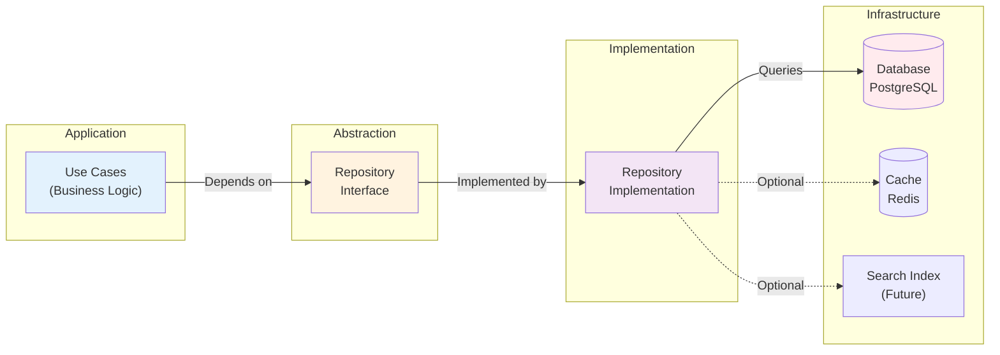

# Repository Pattern Implementation

## Overview

The Anplexa platform implements the Repository Pattern to abstract database access and provide a clean interface for data operations. This pattern decouples business logic from database implementation details.

---

## Pattern Explanation

### What is the Repository Pattern?

The Repository Pattern is a structural design pattern that:

1. **Abstracts Database Logic** - Encapsulates all data access logic in dedicated classes
2. **Provides a Collection-Like Interface** - Repositories act as in-memory collections of domain objects
3. **Isolates Domain Logic** - Business logic never directly accesses the database
4. **Enables Testability** - Easy to mock repositories in tests
5. **Simplifies Dependency Management** - Single point of data access configuration

### Architecture Diagram



---

## Core Repositories

### 1. UserRepository

**Purpose**: Manage user account data and authentication-related queries

**File**: `/packages/core/src/repositories/user.repository.ts`

#### Interface Definition

```typescript
export interface IUserRepository {
  create(data: CreateUserInput): Promise<User>;
  getById(id: string): Promise<User | null>;
  getByEmail(email: string): Promise<User | null>;
  update(id: string, data: UpdateUserInput): Promise<User>;
  delete(id: string): Promise<void>;
  getAll(): Promise<User[]>;
  count(): Promise<number>;
}

export interface CreateUserInput {
  email: string;
  displayName: string;
  passwordHash: string;
  subscriptionStatus?: 'free' | 'premium' | 'enterprise';
}

export interface UpdateUserInput {
  displayName?: string;
  email?: string;
  subscriptionStatus?: 'free' | 'premium' | 'enterprise';
  isActive?: boolean;
}
```

#### Implementation Example

```typescript
export class UserRepository implements IUserRepository {
  constructor(private db: ReturnType<typeof drizzle>) {}

  async create(data: CreateUserInput): Promise<User> {
    const [user] = await this.db
      .insert(schema.users)
      .values({
        id: generateId(),
        ...data,
        createdAt: new Date(),
        updatedAt: new Date(),
      })
      .returning();

    return user;
  }

  async getById(id: string): Promise<User | null> {
    const user = await this.db.query.users.findFirst({
      where: (table) => eq(table.id, id),
    });
    return user || null;
  }

  async getByEmail(email: string): Promise<User | null> {
    const user = await this.db.query.users.findFirst({
      where: (table) => eq(table.email, email),
    });
    return user || null;
  }

  async update(id: string, data: UpdateUserInput): Promise<User> {
    const [updated] = await this.db
      .update(schema.users)
      .set({ ...data, updatedAt: new Date() })
      .where(eq(schema.users.id, id))
      .returning();

    if (!updated) throw new NotFoundError(`User ${id} not found`);
    return updated;
  }

  async delete(id: string): Promise<void> {
    await this.db
      .delete(schema.users)
      .where(eq(schema.users.id, id));
  }

  async getAll(): Promise<User[]> {
    return this.db.query.users.findMany();
  }

  async count(): Promise<number> {
    const [result] = await this.db
      .select({ count: count() })
      .from(schema.users);
    return result.count;
  }
}
```

#### Usage in Use Cases

```typescript
export class LoginUserUseCase {
  constructor(
    private userRepository: IUserRepository,
    private passwordService: PasswordService,
  ) {}

  async execute(input: LoginInput): Promise<LoginOutput> {
    // Repository abstraction - no direct DB access
    const user = await this.userRepository.getByEmail(input.email);

    if (!user) {
      throw new AuthenticationError('User not found');
    }

    const isValid = await this.passwordService.compare(
      input.password,
      user.passwordHash
    );

    if (!isValid) {
      throw new AuthenticationError('Invalid password');
    }

    return {
      user: UserMapper.toDTO(user),
      tokens: { /* ... */ },
    };
  }
}
```

---

### 2. ConversationRepository

**Purpose**: Manage conversation grouping and metadata

**File**: `/packages/core/src/repositories/conversation.repository.ts`

#### Interface Definition

```typescript
export interface IConversationRepository {
  create(data: CreateConversationInput): Promise<Conversation>;
  getById(id: string): Promise<Conversation | null>;
  getByUserId(userId: string): Promise<Conversation[]>;
  update(id: string, data: UpdateConversationInput): Promise<Conversation>;
  delete(id: string): Promise<void>;
  getAll(): Promise<Conversation[]>;
}

export interface CreateConversationInput {
  userId: string;
  title: string;
  summary?: string;
}

export interface UpdateConversationInput {
  title?: string;
  summary?: string;
}
```

#### Key Methods

```typescript
// Get all conversations for a user (with pagination)
async getByUserId(userId: string, pagination?: Pagination): Promise<Conversation[]> {
  return this.db.query.conversations.findMany({
    where: (table) => eq(table.userId, userId),
    limit: pagination?.limit || 20,
    offset: pagination?.offset || 0,
    orderBy: (table) => [desc(table.createdAt)],
  });
}

// Update conversation summary
async updateSummary(id: string, summary: string): Promise<void> {
  await this.db
    .update(schema.conversations)
    .set({ summary, updatedAt: new Date() })
    .where(eq(schema.conversations.id, id));
}
```

---

### 3. MessageRepository

**Purpose**: Manage message persistence and retrieval

**File**: `/packages/core/src/repositories/message.repository.ts`

#### Interface Definition

```typescript
export interface IMessageRepository {
  create(data: CreateMessageInput): Promise<Message>;
  getById(id: string): Promise<Message | null>;
  getByConversationId(conversationId: string): Promise<Message[]>;
  delete(id: string): Promise<void>;
  getAll(): Promise<Message[]>;
  deleteByConversationId(conversationId: string): Promise<number>;
}

export interface CreateMessageInput {
  conversationId: string;
  content: string;
  sender: 'user' | 'assistant';
  metadata?: Record<string, any>;
}
```

#### Special Methods

```typescript
// Get conversation history with efficient querying
async getByConversationId(
  conversationId: string,
  options?: { limit?: number; offset?: number }
): Promise<Message[]> {
  return this.db.query.messages.findMany({
    where: (table) => eq(table.conversationId, conversationId),
    limit: options?.limit || 100,
    offset: options?.offset || 0,
    orderBy: (table) => [asc(table.createdAt)],
  });
}

// Cleanup messages for deleted conversations
async deleteByConversationId(conversationId: string): Promise<number> {
  const result = await this.db
    .delete(schema.messages)
    .where(eq(schema.messages.conversationId, conversationId));
  return result.count || 0;
}
```

---

### 4. SessionRepository

**Purpose**: Manage authentication sessions and tokens

**File**: `/packages/core/src/repositories/session.repository.ts`

#### Interface Definition

```typescript
export interface ISessionRepository {
  create(data: CreateSessionInput): Promise<Session>;
  getByRefreshToken(token: string): Promise<Session | null>;
  delete(id: string): Promise<void>;
  deleteByUserId(userId: string): Promise<number>;
  getAll(): Promise<Session[]>;
}

export interface CreateSessionInput {
  userId: string;
  accessToken: string;
  refreshToken: string;
  expiresAt: Date;
}
```

#### Token Management

```typescript
// Validate and retrieve session from refresh token
async getByRefreshToken(token: string): Promise<Session | null> {
  const session = await this.db.query.sessions.findFirst({
    where: (table) => eq(table.refreshToken, token),
  });

  if (!session) return null;

  // Check if token is expired
  if (session.expiresAt < new Date()) {
    await this.delete(session.id);
    return null;
  }

  return session;
}

// Invalidate all sessions for user (logout all devices)
async deleteByUserId(userId: string): Promise<number> {
  const result = await this.db
    .delete(schema.sessions)
    .where(eq(schema.sessions.userId, userId));
  return result.count || 0;
}
```

---

### 5. PasswordResetTokenRepository

**Purpose**: Manage password reset tokens with expiration

**File**: `/packages/core/src/repositories/password-reset-token.repository.ts`

#### Interface Definition

```typescript
export interface IPasswordResetTokenRepository {
  create(data: CreateTokenInput): Promise<PasswordResetToken>;
  getByToken(token: string): Promise<PasswordResetToken | null>;
  update(id: string, data: UpdateTokenInput): Promise<PasswordResetToken>;
  deleteExpired(): Promise<number>;
}

export interface CreateTokenInput {
  userId: string;
  token: string;
  expiresAt: Date;
}
```

#### Token Lifecycle

```typescript
// Create reset token (valid for 1 hour)
async create(data: CreateTokenInput): Promise<PasswordResetToken> {
  return this.db
    .insert(schema.passwordResetTokens)
    .values({
      id: generateId(),
      ...data,
      createdAt: new Date(),
    })
    .returning()
    .then(([token]) => token);
}

// Retrieve and validate token
async getByToken(token: string): Promise<PasswordResetToken | null> {
  const record = await this.db.query.passwordResetTokens.findFirst({
    where: (table) => eq(table.token, token),
  });

  if (!record) return null;
  if (record.expiresAt < new Date()) {
    await this.delete(record.id);
    return null;
  }

  return record;
}

// Cleanup expired tokens
async deleteExpired(): Promise<number> {
  const result = await this.db
    .delete(schema.passwordResetTokens)
    .where(lt(schema.passwordResetTokens.expiresAt, new Date()));
  return result.count || 0;
}
```

---

### 6. ApiKeyRepository

**Purpose**: Manage API keys for external integrations

**File**: `/packages/core/src/repositories/api-key.repository.ts`

#### Interface Definition

```typescript
export interface IApiKeyRepository {
  create(data: CreateApiKeyInput): Promise<ApiKey>;
  getById(id: string): Promise<ApiKey | null>;
  getByKey(key: string): Promise<ApiKey | null>;
  getAll(): Promise<ApiKey[]>;
  deactivate(id: string): Promise<void>;
  delete(id: string): Promise<void>;
}

export interface CreateApiKeyInput {
  userId: string;
  name: string;
  key: string;
  secret: string;
}
```

#### Usage Example

```typescript
// Validate API key on request
async getByKey(key: string): Promise<ApiKey | null> {
  const apiKey = await this.db.query.apiKeys.findFirst({
    where: (table) => eq(table.key, key),
  });

  if (!apiKey || !apiKey.isActive) return null;

  // Update last used timestamp
  await this.db
    .update(schema.apiKeys)
    .set({ lastUsedAt: new Date() })
    .where(eq(schema.apiKeys.id, apiKey.id));

  return apiKey;
}

// Deactivate key without deletion (audit trail)
async deactivate(id: string): Promise<void> {
  await this.db
    .update(schema.apiKeys)
    .set({
      isActive: false,
      deactivatedAt: new Date(),
      updatedAt: new Date(),
    })
    .where(eq(schema.apiKeys.id, id));
}
```

---

### 7. ApiUsageRepository

**Purpose**: Track API usage metrics and quotas

**File**: `/packages/core/src/repositories/api-usage.repository.ts`

#### Interface Definition

```typescript
export interface IApiUsageRepository {
  create(data: CreateUsageInput): Promise<ApiUsage>;
  getByDateRange(
    userId: string,
    startDate: Date,
    endDate: Date
  ): Promise<ApiUsage[]>;
  getUsageStats(userId: string): Promise<UsageStats>;
}

export interface CreateUsageInput {
  userId: string;
  endpoint: string;
  method: 'GET' | 'POST' | 'PUT' | 'DELETE';
  statusCode: number;
  responseTime: number;
}

export interface UsageStats {
  totalRequests: number;
  totalResponseTime: number;
  averageResponseTime: number;
  errorCount: number;
  errorRate: number;
}
```

#### Analytics Methods

```typescript
// Get detailed usage for date range
async getByDateRange(
  userId: string,
  startDate: Date,
  endDate: Date
): Promise<ApiUsage[]> {
  return this.db.query.apiUsage.findMany({
    where: (table) =>
      and(
        eq(table.userId, userId),
        gte(table.createdAt, startDate),
        lte(table.createdAt, endDate)
      ),
    orderBy: (table) => [desc(table.createdAt)],
  });
}

// Calculate usage statistics
async getUsageStats(userId: string): Promise<UsageStats> {
  const usage = await this.db.query.apiUsage.findMany({
    where: (table) => eq(table.userId, userId),
  });

  const totalRequests = usage.length;
  const errorCount = usage.filter((u) => u.statusCode >= 400).length;
  const totalResponseTime = usage.reduce((sum, u) => sum + u.responseTime, 0);

  return {
    totalRequests,
    totalResponseTime,
    averageResponseTime: totalResponseTime / totalRequests,
    errorCount,
    errorRate: errorCount / totalRequests,
  };
}
```

---

### 8. FunnelApiKeyRepository

**Purpose**: Manage funnel-specific API keys

**File**: `/packages/core/src/repositories/funnel-api-key.repository.ts`

Similar to ApiKeyRepository but scoped to funnel operations.

---

### 9. UserFeedbackRepository

**Purpose**: Collect and manage user feedback

**File**: `/packages/core/src/repositories/user-feedback.repository.ts`

#### Interface Definition

```typescript
export interface IUserFeedbackRepository {
  create(data: CreateFeedbackInput): Promise<UserFeedback>;
  getByUserId(userId: string): Promise<UserFeedback[]>;
  delete(id: string): Promise<void>;
  deleteByUserId(userId: string): Promise<number>;
}

export interface CreateFeedbackInput {
  userId: string;
  message: string;
  rating?: 1 | 2 | 3 | 4 | 5;
  category?: string;
}
```

---

## Complete Repository Inventory

```typescript
export interface AllRepositories {
  userRepository: IUserRepository;
  conversationRepository: IConversationRepository;
  messageRepository: IMessageRepository;
  sessionRepository: ISessionRepository;
  passwordResetTokenRepository: IPasswordResetTokenRepository;
  apiKeyRepository: IApiKeyRepository;
  funnelApiKeyRepository: IFunnelApiKeyRepository;
  apiUsageRepository: IApiUsageRepository;
  userFeedbackRepository: IUserFeedbackRepository;
}
```

---

## Implementation Pattern

### 1. Interface-First Design

```typescript
// Step 1: Define interface (abstraction)
export interface IUserRepository {
  create(data: CreateUserInput): Promise<User>;
  getById(id: string): Promise<User | null>;
  update(id: string, data: UpdateUserInput): Promise<User>;
  delete(id: string): Promise<void>;
}

// Step 2: Implement interface
export class UserRepository implements IUserRepository {
  constructor(private db: ReturnType<typeof drizzle>) {}

  async create(data: CreateUserInput): Promise<User> {
    // Implementation
  }

  async getById(id: string): Promise<User | null> {
    // Implementation
  }

  // ... other methods
}
```

### 2. Dependency Injection

```typescript
// Step 3: Register in DI container
container.register({
  userRepository: asClass(UserRepository).singleton(),
});

// Step 4: Inject into use cases
export class LoginUserUseCase {
  constructor(private userRepository: IUserRepository) {}

  async execute(input: LoginInput): Promise<LoginOutput> {
    const user = await this.userRepository.getByEmail(input.email);
    // Use repository
  }
}
```

### 3. Error Handling

```typescript
// Use domain errors instead of throwing generic errors
async getById(id: string): Promise<User | null> {
  const user = await this.db.query.users.findFirst({
    where: (table) => eq(table.id, id),
  });

  if (!user) {
    throw new NotFoundError(`User ${id} not found`);
  }

  return user;
}
```

---

## Common Repository Methods

### CRUD Operations

```typescript
// Create
async create(data: CreateInput): Promise<T> {
  const [record] = await this.db
    .insert(schema.table)
    .values(data)
    .returning();
  return record;
}

// Read
async getById(id: string): Promise<T | null> {
  return this.db.query.table.findFirst({
    where: (table) => eq(table.id, id),
  });
}

// Update
async update(id: string, data: UpdateInput): Promise<T> {
  const [updated] = await this.db
    .update(schema.table)
    .set(data)
    .where(eq(schema.table.id, id))
    .returning();
  return updated;
}

// Delete
async delete(id: string): Promise<void> {
  await this.db
    .delete(schema.table)
    .where(eq(schema.table.id, id));
}
```

### Querying

```typescript
// Find multiple
async findMany(filter?: Filter): Promise<T[]> {
  return this.db.query.table.findMany({
    where: filter ? buildWhere(filter) : undefined,
    orderBy: (table) => [desc(table.createdAt)],
  });
}

// Count
async count(filter?: Filter): Promise<number> {
  const [result] = await this.db
    .select({ count: count() })
    .from(schema.table)
    .where(filter ? buildWhere(filter) : undefined);
  return result.count;
}

// Exists
async exists(id: string): Promise<boolean> {
  const record = await this.db.query.table.findFirst({
    where: (table) => eq(table.id, id),
  });
  return !!record;
}
```

---

## Testing Repositories

### Unit Testing with Mocks

```typescript
import { describe, it, expect, vi } from 'vitest';

describe('UserRepository', () => {
  let userRepository: UserRepository;
  let mockDb: ReturnType<typeof drizzle>;

  beforeEach(() => {
    mockDb = {
      insert: vi.fn(),
      update: vi.fn(),
      delete: vi.fn(),
      query: {
        users: {
          findFirst: vi.fn(),
          findMany: vi.fn(),
        },
      },
    } as any;

    userRepository = new UserRepository(mockDb);
  });

  it('should create a user', async () => {
    const mockUser = {
      id: 'user-1',
      email: 'test@example.com',
      displayName: 'Test User',
    };

    mockDb.insert.mockReturnValue({
      values: vi.fn().mockReturnValue({
        returning: vi.fn().mockResolvedValue([mockUser]),
      }),
    });

    const result = await userRepository.create({
      email: 'test@example.com',
      displayName: 'Test User',
      passwordHash: 'hash',
    });

    expect(result.email).toBe('test@example.com');
  });

  it('should return null for non-existent user', async () => {
    mockDb.query.users.findFirst.mockResolvedValue(null);

    const result = await userRepository.getById('non-existent');

    expect(result).toBeNull();
  });
});
```

---

## Best Practices

### 1. Interface Segregation

Don't put all methods in one interface - segregate by use case:

```typescript
// Bad - too many methods
interface IRepository {
  create(): Promise<T>;
  get(): Promise<T>;
  update(): Promise<T>;
  delete(): Promise<T>;
  search(): Promise<T[]>;
  export(): Promise<Buffer>;
  // ... 10 more methods
}

// Good - segregated interfaces
interface IRepository {
  create(): Promise<T>;
  get(): Promise<T>;
  update(): Promise<T>;
  delete(): Promise<T>;
}

interface ISearchRepository extends IRepository {
  search(): Promise<T[]>;
}

interface IExportRepository extends IRepository {
  export(): Promise<Buffer>;
}
```

### 2. Pagination Support

Always support pagination in list methods:

```typescript
async getAll(options?: PaginationOptions): Promise<PaginatedResult<T>> {
  const limit = options?.limit || 20;
  const offset = options?.offset || 0;

  const [data, total] = await Promise.all([
    this.db.query.table.findMany({
      limit,
      offset,
    }),
    this.count(),
  ]);

  return {
    data,
    total,
    limit,
    offset,
    hasMore: offset + limit < total,
  };
}
```

### 3. Transaction Support

For multi-step operations:

```typescript
async transferMessages(
  fromConversationId: string,
  toConversationId: string
): Promise<void> {
  await this.db.transaction(async (tx) => {
    // Move messages
    await tx
      .update(schema.messages)
      .set({ conversationId: toConversationId })
      .where(eq(schema.messages.conversationId, fromConversationId));

    // Update timestamps
    await tx
      .update(schema.conversations)
      .set({ updatedAt: new Date() })
      .where(
        inArray(schema.conversations.id, [fromConversationId, toConversationId])
      );
  });
}
```

### 4. Caching Layer (Future)

```typescript
export class CachedUserRepository implements IUserRepository {
  constructor(
    private inner: UserRepository,
    private cache: RedisClient
  ) {}

  async getById(id: string): Promise<User | null> {
    // Check cache first
    const cached = await this.cache.get(`user:${id}`);
    if (cached) return JSON.parse(cached);

    // Fetch from database
    const user = await this.inner.getById(id);

    // Store in cache
    if (user) {
      await this.cache.setex(`user:${id}`, 3600, JSON.stringify(user));
    }

    return user;
  }
}
```

---

## Directory Structure

```
packages/core/src/repositories/
├── interfaces/
│   ├── user.repository.interface.ts
│   ├── conversation.repository.interface.ts
│   ├── message.repository.interface.ts
│   ├── session.repository.interface.ts
│   ├── password-reset-token.repository.interface.ts
│   ├── api-key.repository.interface.ts
│   ├── funnel-api-key.repository.interface.ts
│   ├── api-usage.repository.interface.ts
│   ├── user-feedback.repository.interface.ts
│   └── index.ts
├── user.repository.ts
├── conversation.repository.ts
├── message.repository.ts
├── session.repository.ts
├── password-reset-token.repository.ts
├── api-key.repository.ts
├── funnel-api-key.repository.ts
├── api-usage.repository.ts
├── user-feedback.repository.ts
├── __tests__/
│   ├── user.repository.test.ts
│   ├── conversation.repository.test.ts
│   ├── message.repository.test.ts
│   └── ... (one test per repository)
└── index.ts (barrel export)
```

---

## Conclusion

The Repository Pattern provides a clean, testable abstraction for data access. By following the patterns documented here, you can:

- Keep business logic (use cases) independent of database details
- Easy switch database implementations without affecting use cases
- Write unit tests without database setup
- Maintain clear separation of concerns
- Scale to multiple data sources (SQL, NoSQL, APIs)

---

**Document Version**: 1.0
**Last Updated**: January 14, 2026
