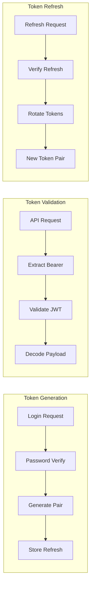
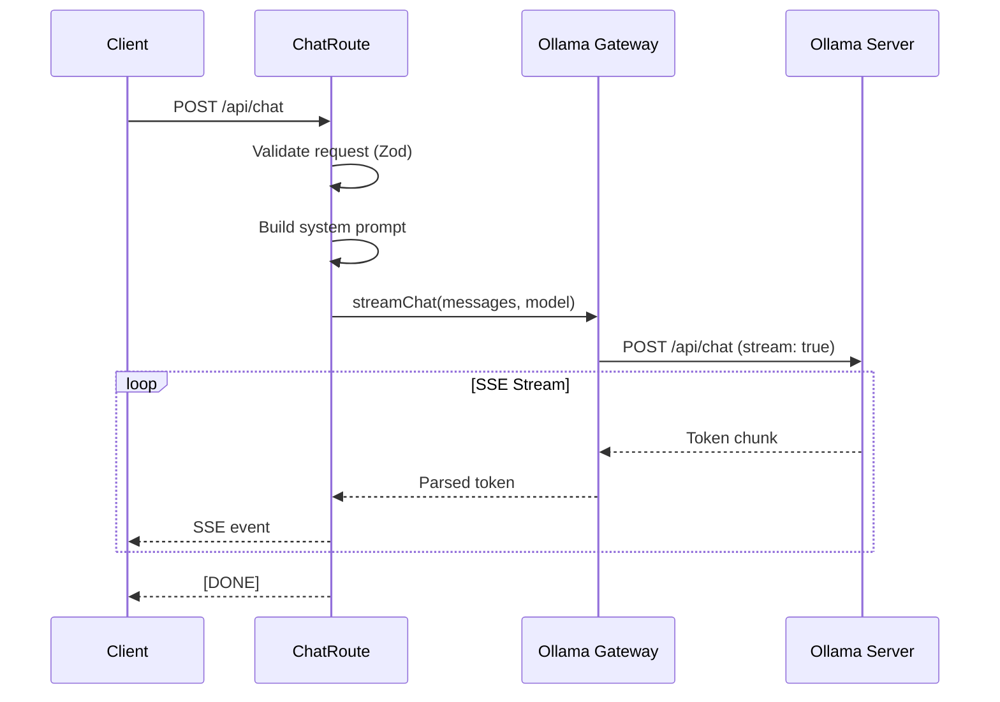

# Backend API Architecture

Deep-dive into the Express.js backend API architecture, patterns, and structure.

## Current Architecture

The backend follows a **layered architecture** with infrastructure focus:

```
server/
├── infrastructure/           # External integrations
│   ├── adapters/            # Service gateways
│   │   └── ollama.ts        # AI inference client
│   ├── auth/                # Authentication
│   │   ├── jwt.ts           # Token management
│   │   └── password.ts      # Bcrypt hashing
│   ├── database/            # Data access
│   │   └── index.ts         # Drizzle setup
│   ├── config/              # Configuration
│   │   └── envValidator.ts  # Env var validation
│   ├── email/               # Email service
│   │   └── resendService.ts # Resend integration
│   └── stripe/              # Payment processing
│       └── stripeService.ts # Stripe client
├── presentation/            # HTTP layer
│   ├── routes/              # API endpoints (15 files)
│   │   ├── authRoutes.ts    # Authentication (985 lines)
│   │   ├── chatRoutes.ts    # Chat/SSE (640 lines)
│   │   ├── stripeRoutes.ts  # Payments (472 lines)
│   │   └── ...
│   └── middleware/          # Request processing
│       ├── auth.ts          # JWT verification
│       ├── rateLimit.ts     # Request throttling
│       └── apiKeys.ts       # API key validation
├── config/                  # App configuration
└── index.ts                 # Express app setup
```

## Layer Responsibilities

### Infrastructure Layer

**Purpose**: Encapsulate external dependencies and provide interfaces.

| Component | Responsibility | External Service |
|-----------|----------------|------------------|
| `OllamaGateway` | AI inference, streaming | Ollama LLM |
| `JWTAdapter` | Token generation/validation | - |
| `PasswordService` | Hash/verify passwords | - |
| `StripeService` | Payments, subscriptions | Stripe API |
| `EmailService` | Transactional emails | Resend |
| `Database` | ORM setup, queries | PostgreSQL/SQLite |

**Example: OllamaGateway**
```typescript
// server/infrastructure/adapters/ollama.ts
export class OllamaGateway {
  private baseUrl: string;
  private apiKey: string;

  constructor(config: OllamaConfig) {
    this.baseUrl = config.baseUrl;
    this.apiKey = config.apiKey;
  }

  async streamChat(messages: Message[], model: string): AsyncIterable<string> {
    const response = await fetch(`${this.baseUrl}/api/chat`, {
      method: 'POST',
      headers: {
        'Authorization': `Bearer ${this.apiKey}`,
        'Content-Type': 'application/json',
      },
      body: JSON.stringify({ messages, model, stream: true }),
    });

    // Return async iterator for SSE transformation
    return this.parseStream(response.body);
  }
}
```

### Presentation Layer

**Purpose**: Handle HTTP requests, validation, and response formatting.

| Component | Responsibility | Endpoints |
|-----------|----------------|-----------|
| `authRoutes` | User authentication | `/api/auth/*` |
| `chatRoutes` | AI chat, SSE | `/api/chat` |
| `conversationRoutes` | CRUD conversations | `/api/conversations/*` |
| `settingsRoutes` | User preferences | `/api/settings/*` |
| `stripeRoutes` | Payments, webhooks | `/api/stripe/*` |
| `adminRoutes` | Admin operations | `/api/admin/*` |

## Authentication System

### Token Flow



### Token Structure

```typescript
// Access Token (15 minute expiry)
interface AccessToken {
  sub: string;      // User ID
  email: string;
  isAdmin: boolean;
  type: 'access';
  iat: number;
  exp: number;
}

// Refresh Token (7 day expiry)
interface RefreshToken {
  sub: string;
  email: string;
  isAdmin: boolean;
  type: 'refresh';
  iat: number;
  exp: number;
}
```

### Middleware Chain

```typescript
// Authentication required
router.get('/protected', authMiddleware, handler);

// Optional authentication (attaches user if valid)
router.get('/public', optionalAuthMiddleware, handler);

// Admin only
router.put('/admin', authMiddleware, adminMiddleware, handler);
```

## Chat System (SSE Streaming)

### Stream Processing



### System Prompt Builder

The system prompt is dynamically built based on:
1. Base companion personality
2. User preferences (gender, name)
3. Response length setting
4. Personality mode (if selected)

```typescript
function buildSystemPrompt(config: CompanionConfig, user: User): string {
  const parts = [
    config.basePrompt,
    `User prefers to be called: ${user.chatName || 'friend'}`,
    `Response length: ${user.responseLength}`,
    config.lengthInstructions[user.responseLength],
  ];

  if (user.personalityMode && config.personalities[user.personalityMode]) {
    parts.push(config.personalities[user.personalityMode].prompt);
  }

  return parts.join('\n\n');
}
```

## Database Access

### Drizzle ORM Setup

```typescript
// server/infrastructure/database/index.ts
import { drizzle } from 'drizzle-orm/better-sqlite3';
import { drizzle as drizzlePg } from 'drizzle-orm/node-postgres';
import * as schema from '@shared/schema';

export function createDatabase() {
  const dbUrl = process.env.DATABASE_URL;

  if (dbUrl?.startsWith('postgres')) {
    return drizzlePg(pool, { schema });
  }

  return drizzle(new Database('./data/companion.db'), { schema });
}
```

### Query Patterns

```typescript
// Find user by email
const user = await db.query.users.findFirst({
  where: eq(users.email, email),
  with: {
    preferences: true,
    sessions: true,
  },
});

// Create conversation with messages
const conversation = await db.insert(conversations).values({
  id: generateId(),
  userId: user.id,
  title: 'New Chat',
}).returning();

// Update subscription status
await db.update(users)
  .set({ subscriptionStatus: 'active' })
  .where(eq(users.stripeCustomerId, customerId));
```

## Rate Limiting

### Configuration

```typescript
// Per-endpoint rate limits
const rateLimits = {
  '/api/auth/login': { max: 10, window: '15m' },
  '/api/auth/register': { max: 5, window: '1h' },
  '/api/chat': { max: 60, window: '1m' },
  '/api/auth/forgot-password': { max: 3, window: '1h' },
};
```

### Current Implementation

```typescript
// In-memory rate limiter (single instance only)
import rateLimit from 'express-rate-limit';

const authLimiter = rateLimit({
  windowMs: 15 * 60 * 1000, // 15 minutes
  max: 10,
  message: { error: 'Too many attempts, please try again later' },
});

router.post('/login', authLimiter, loginHandler);
```

:::warning Limitation
The current in-memory rate limiter doesn't work across multiple server instances. For production scaling, migrate to Redis-based rate limiting.
:::

## Error Handling

### Error Response Format

```typescript
interface ErrorResponse {
  error: string;          // User-friendly message
  code?: string;          // Error code for client handling
  details?: unknown;      // Debug info (dev only)
}

// Example responses
{ error: 'Invalid credentials' }                    // 401
{ error: 'Email already registered', code: 'EMAIL_EXISTS' }  // 409
{ error: 'Rate limit exceeded', code: 'RATE_LIMITED' }       // 429
{ error: 'Insufficient credits', code: 'CREDITS_EXHAUSTED' } // 402
```

### Global Error Handler

```typescript
// server/index.ts
app.use((err: Error, req: Request, res: Response, next: NextFunction) => {
  console.error('Error:', err);

  res.status(500).json({
    error: 'Internal server error',
    message: process.env.NODE_ENV === 'development' ? err.message : undefined,
  });
});
```

## Configuration Management

### Environment Variables

| Variable | Required | Default | Description |
|----------|----------|---------|-------------|
| `OLLAMA_BASE_URL` | Yes | - | LLM server URL |
| `OLLAMA_API_KEY` | Yes | - | LLM authentication |
| `JWT_SECRET` | Yes | - | Token signing key |
| `DATABASE_URL` | No | SQLite | Database connection |
| `STRIPE_SECRET_KEY` | Yes | - | Stripe API key |
| `RESEND_API_KEY` | Yes | - | Email service key |
| `PORT` | No | 5000 | Server port |

### Validation on Startup

```typescript
// server/infrastructure/config/envValidator.ts
export function validateEnvironment(): void {
  const required = ['OLLAMA_BASE_URL', 'OLLAMA_API_KEY', 'JWT_SECRET'];

  for (const key of required) {
    if (!process.env[key]) {
      throw new Error(`Missing required environment variable: ${key}`);
    }
  }

  // Warn about development defaults
  if (process.env.JWT_SECRET === 'development-secret') {
    console.warn('WARNING: Using default JWT secret. Set JWT_SECRET in production.');
  }
}
```

## Identified Issues & Improvements

### Current Issues

| Issue | Severity | Description |
|-------|----------|-------------|
| Fat Controllers | High | Route handlers contain business logic (985 lines in authRoutes) |
| No Domain Layer | High | ORM schemas only, no business entities |
| No Use Cases | High | No application service layer |
| In-Memory Rate Limiting | Medium | Won't scale to multiple instances |
| Console Logging | Medium | No structured logging |

### Recommended Target Architecture

```
server/
├── domain/                  # NEW: Business rules
│   ├── entities/           # User, Conversation, Message
│   ├── value-objects/      # Email, Credits
│   ├── services/           # CreditService, PromptBuilder
│   └── repositories/       # Interfaces (IUserRepository)
├── use-cases/              # NEW: Application logic
│   ├── auth/               # LoginUser, RegisterUser
│   ├── chat/               # SendMessage
│   └── subscription/       # CreateCheckout
├── adapters/               # Interface implementations
│   ├── api/                # Thin controllers (< 50 lines)
│   ├── persistence/        # DrizzleUserRepository
│   └── external/           # OllamaGateway, StripeService
└── infrastructure/         # Framework config, DI
```

See [Backend Improvements](/docs/improvement-plans/backend-improvements) for the full migration plan.
