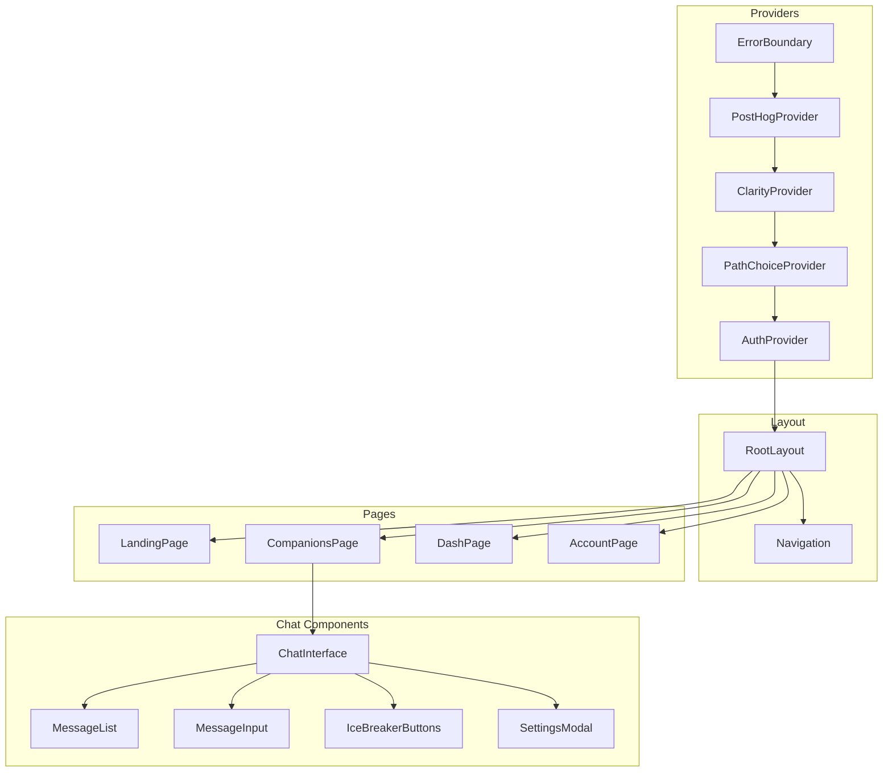
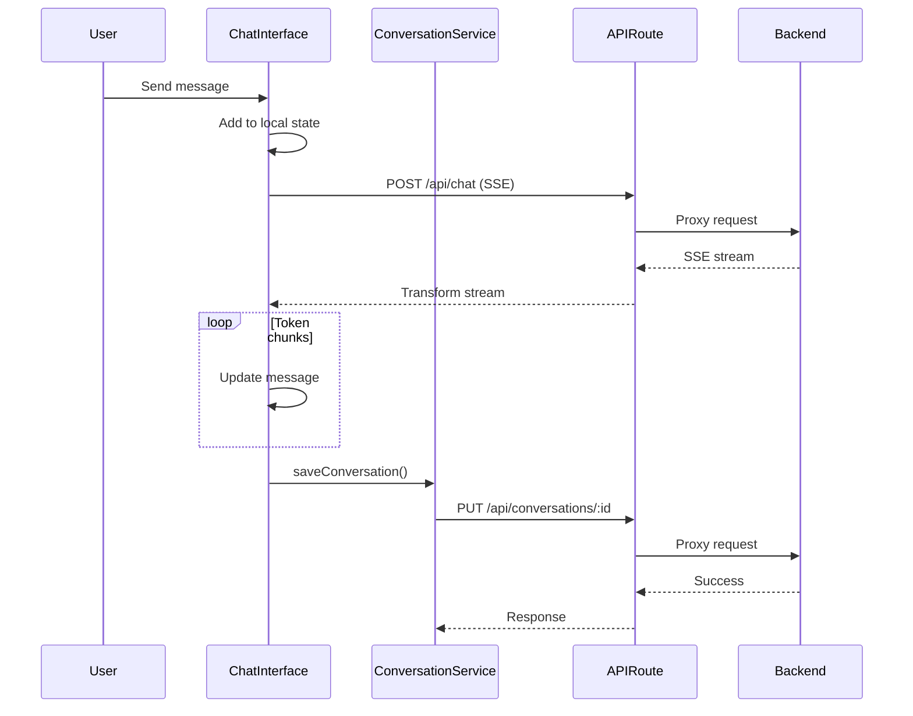
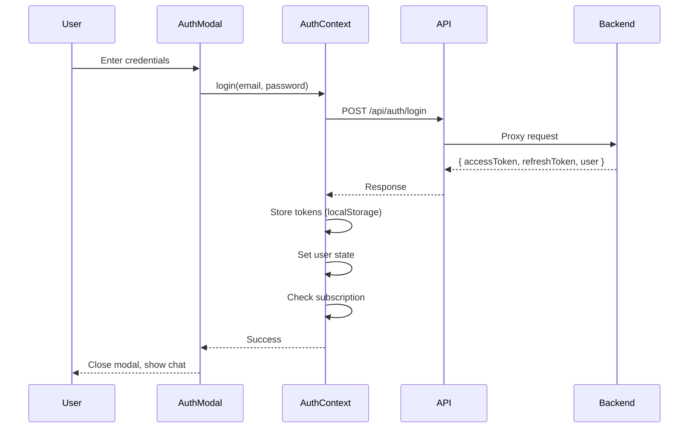

# Companions App Architecture

Deep-dive into the Next.js frontend architecture for the AI chat application.

## Current Architecture

The Companions app is a **Next.js 16 App Router** application with context-based state management:

```
app/
├── (routes)/                 # Route groups
│   ├── page.tsx             # Landing/choice page
│   ├── companions/          # Chat interface
│   ├── dash/                # User dashboard
│   ├── account/             # Account settings
│   └── ...
├── api/                     # API proxy routes
│   ├── chat/route.ts        # SSE chat proxy
│   ├── conversations/       # CRUD proxy
│   ├── auth/                # Auth proxy
│   └── _lib/api-utils.ts    # Shared proxy utilities
├── layout.tsx               # Root layout
└── globals.css              # Tailwind + theme

components/
├── chat-interface.tsx       # Main chat (949 lines) ⚠️
├── providers.tsx            # Provider composition
├── ui/                      # shadcn/ui components
└── modals/                  # Auth, upgrade modals

lib/
├── auth-context.tsx         # Auth state (280 lines)
├── conversation-service.ts  # CRUD (463 lines)
├── domain/entities/         # Domain layer (emerging)
├── adapters/                # Infrastructure (underused)
└── utils.ts                 # Helpers
```

## Component Hierarchy



## State Management

### Auth Context

```typescript
// lib/auth-context.tsx
interface AuthState {
  user: User | null;
  accessToken: string | null;
  refreshToken: string | null;
  subscriptionStatus: SubscriptionStatus | null;
  isLoading: boolean;
}

interface AuthContextValue extends AuthState {
  login: (email: string, password: string) => Promise<void>;
  logout: () => void;
  refresh: () => Promise<boolean>;
  checkSubscription: () => Promise<void>;
}
```

### Path Choice Context

```typescript
// lib/path-choice-context.tsx
interface PathChoiceState {
  selectedPath: 'business' | 'companions' | 'create' | null;
  hasSelectedPath: boolean;
  setSelectedPath: (path: string) => void;
  clearPath: () => void;
}
```

### Data Flow



## API Proxy Pattern

The Companions app uses Next.js API routes as a proxy to the backend:

### Why Proxy?
1. **CORS avoidance**: Browser requests to same origin
2. **Token injection**: Server-side auth header attachment
3. **Error transformation**: Normalize backend errors
4. **Rate limiting**: Add frontend-specific limits

### Implementation

```typescript
// app/api/_lib/api-utils.ts
export async function proxyPost(
  endpoint: string,
  body: unknown,
  authHeader?: string
) {
  const response = await fetch(`${API_URL}${endpoint}`, {
    method: 'POST',
    headers: {
      'Content-Type': 'application/json',
      'X-API-Key': BACKEND_API_KEY,
      ...(authHeader && { Authorization: authHeader }),
    },
    body: JSON.stringify(body),
  });

  return response;
}

// Usage in route handler
export async function POST(request: Request) {
  const body = await request.json();
  const authHeader = request.headers.get('Authorization');

  const response = await proxyPost('/api/chat', body, authHeader);

  // Transform SSE stream for AI SDK
  return new Response(transformStream(response.body), {
    headers: { 'Content-Type': 'text/event-stream' },
  });
}
```

## Chat Interface Deep Dive

### Current Issues

The `ChatInterface` component (949 lines) is a "God Component" with:
- 12+ useEffect hooks
- Mixed guest/auth logic
- Analytics, ice-breakers, UI all in one
- Business logic in presentation layer

### Current Structure

```typescript
export function ChatInterface() {
  // State (15+ useState calls)
  const [messages, setMessages] = useState<Message[]>([]);
  const [input, setInput] = useState('');
  const [isLoading, setIsLoading] = useState(false);
  const [showIceBreakers, setShowIceBreakers] = useState(true);
  // ... 10+ more state variables

  // Effects (12+ useEffect calls)
  useEffect(() => { /* Load conversation */ }, []);
  useEffect(() => { /* Check guest limits */ }, [messages]);
  useEffect(() => { /* Save conversation */ }, [messages]);
  useEffect(() => { /* Track analytics */ }, []);
  // ... 8+ more effects

  // AI SDK integration
  const { append, isStreaming } = useChat({
    transport: customTransport,
    onFinish: handleFinish,
  });

  // Handlers (20+ functions)
  const handleSend = async () => { /* ... */ };
  const handleIceBreaker = (text: string) => { /* ... */ };
  const handleNewConversation = () => { /* ... */ };
  // ... many more

  // Render (200+ lines of JSX)
  return (
    <div className="chat-container">
      {/* Header, MessageList, Input, Modals, etc. */}
    </div>
  );
}
```

### Recommended Decomposition

```
components/chat/
├── ChatInterface.tsx        # Orchestrator (< 100 lines)
├── MessageList.tsx          # Message rendering
├── MessageInput.tsx         # Input with send button
├── IceBreakerButtons.tsx    # Conversation starters
├── ChatHeader.tsx           # Title, settings button
└── hooks/
    ├── useChat.ts           # AI SDK integration
    ├── useConversation.ts   # CRUD + persistence
    ├── useGuestMode.ts      # Guest limit tracking
    ├── usePreferences.ts    # User preferences
    └── useIceBreakers.ts    # Ice breaker logic
```

## Authentication Flow

### Login Flow



### Token Refresh

```typescript
// lib/auth-context.tsx
const refresh = async (): Promise<boolean> => {
  const refreshToken = localStorage.getItem('refreshToken');
  if (!refreshToken) return false;

  try {
    const response = await fetch('/api/auth/refresh', {
      method: 'POST',
      headers: { 'Content-Type': 'application/json' },
      body: JSON.stringify({ refreshToken }),
    });

    if (!response.ok) {
      logout();
      return false;
    }

    const data = await response.json();
    localStorage.setItem('accessToken', data.accessToken);
    localStorage.setItem('refreshToken', data.refreshToken);
    return true;
  } catch {
    logout();
    return false;
  }
};
```

## Guest Mode System

### How It Works

1. **No auth required**: Users can chat without logging in
2. **Message limit**: 6 free messages tracked in localStorage
3. **Prompt to register**: After limit, show auth modal
4. **Conversion tracking**: PostHog events for funnel analysis

```typescript
// Guest mode logic
const GUEST_LIMIT = 6;

function checkGuestLimit(): boolean {
  const count = parseInt(localStorage.getItem('guestMessageCount') || '0');
  return count < GUEST_LIMIT;
}

function incrementGuestCount(): void {
  const count = parseInt(localStorage.getItem('guestMessageCount') || '0');
  localStorage.setItem('guestMessageCount', String(count + 1));
}
```

## Styling System

### Tailwind CSS v4 + CSS Variables

```css
/* globals.css */
:root {
  --primary: #7B2CBF;
  --accent: #5A189A;
  --background: #121212;
  --foreground: #E0E1DD;
  --security: #415A77;
}

/* Fluid typography */
.text-fluid-lg {
  font-size: clamp(1.125rem, 2vw, 1.5rem);
}

/* Custom utilities */
.glow {
  box-shadow: 0 0 20px var(--primary);
}
```

### shadcn/ui Components

Using New York style variant with 20+ components:
- Button, Input, Card, Dialog
- Form components (Form, Field, Label)
- Layout (Tabs, Accordion)
- Feedback (Toast via Sonner)

## Emerging Domain Layer

The codebase has started implementing Clean Architecture patterns:

```typescript
// lib/domain/entities/message.ts
export interface Message {
  id: string;
  role: 'user' | 'assistant' | 'system';
  content: string;
  createdAt: Date;
}

export function normalizeMessage(raw: any): Message {
  return {
    id: raw.id || generateId(),
    role: raw.role,
    content: raw.content,
    createdAt: new Date(raw.createdAt || Date.now()),
  };
}

// lib/domain/entities/conversation.ts
export interface Conversation {
  id: string;
  title: string;
  messages: Message[];
  createdAt: Date;
  updatedAt: Date;
}

export function groupMessagesByDate(messages: Message[]): Map<string, Message[]> {
  // Pure function for message grouping
}
```

## Identified Issues & Improvements

| Issue | Severity | File | Description |
|-------|----------|------|-------------|
| God Component | High | `chat-interface.tsx` | 949 lines, 12+ effects |
| Unused Adapters | Medium | `lib/adapters/` | Created but not used |
| Duplicate Code | Medium | `conversation-service.ts` | Duplicates domain entities |
| Raw fetch | Medium | `auth-context.tsx` | Bypasses apiClient |
| No Tests | High | - | Zero test coverage |

See [Frontend Improvements](/docs/improvement-plans/frontend-improvements) for the full refactoring plan.
