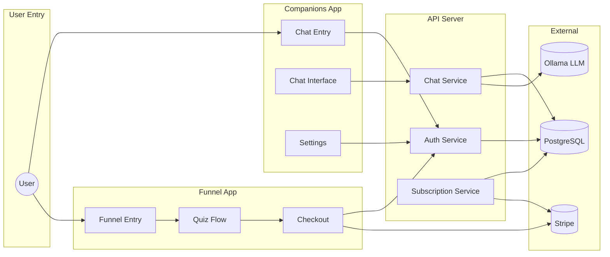
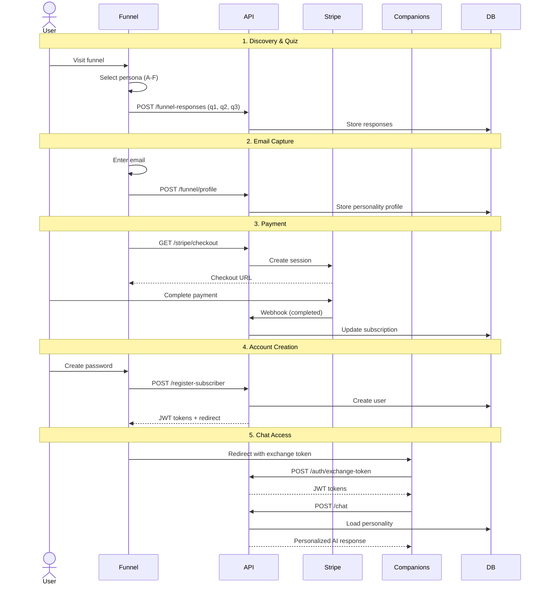
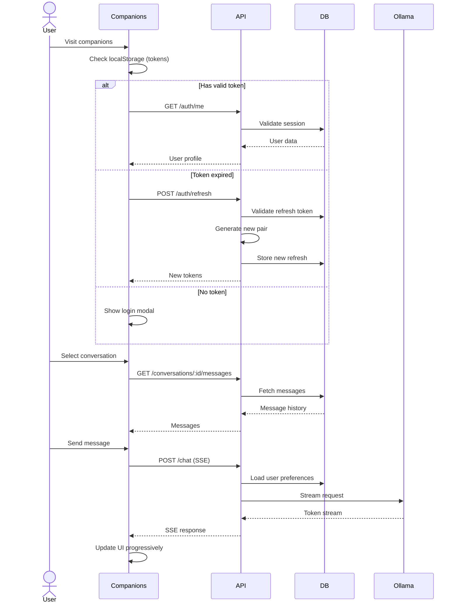
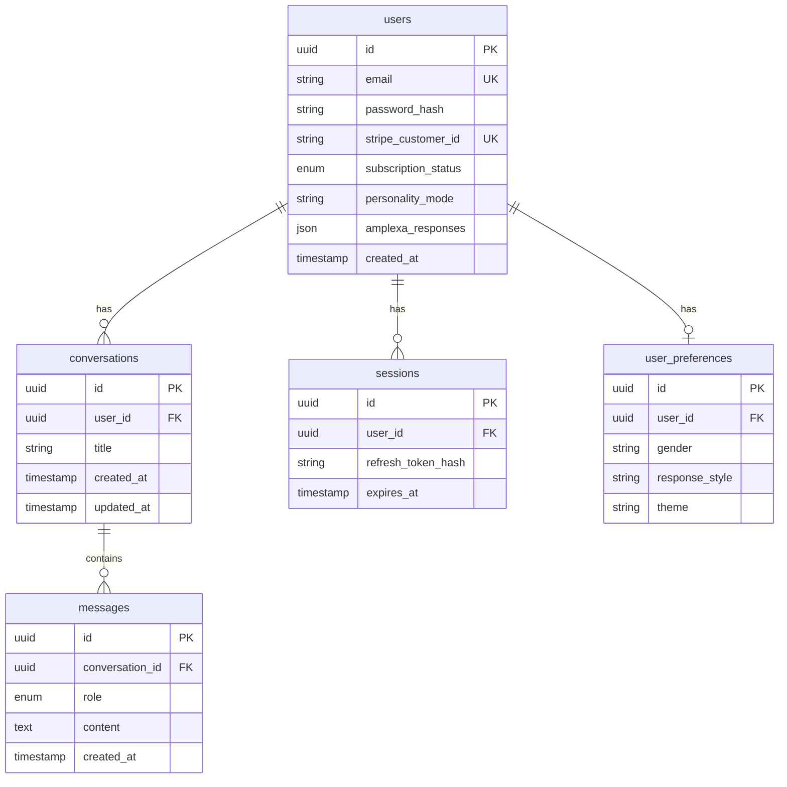
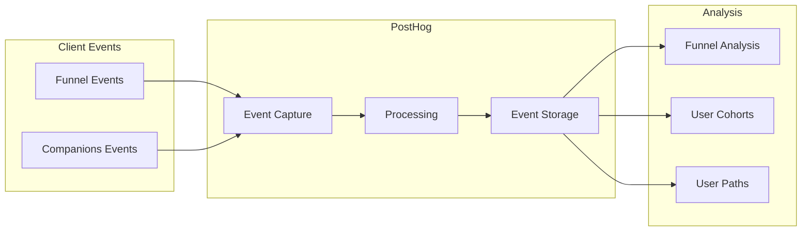
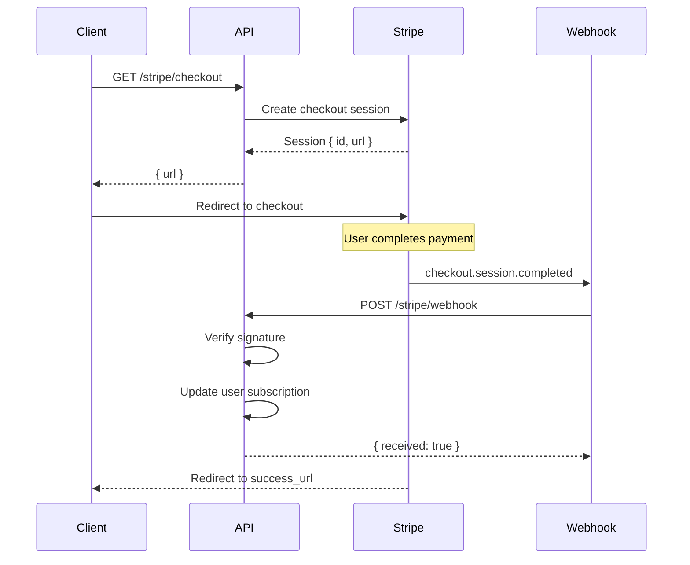
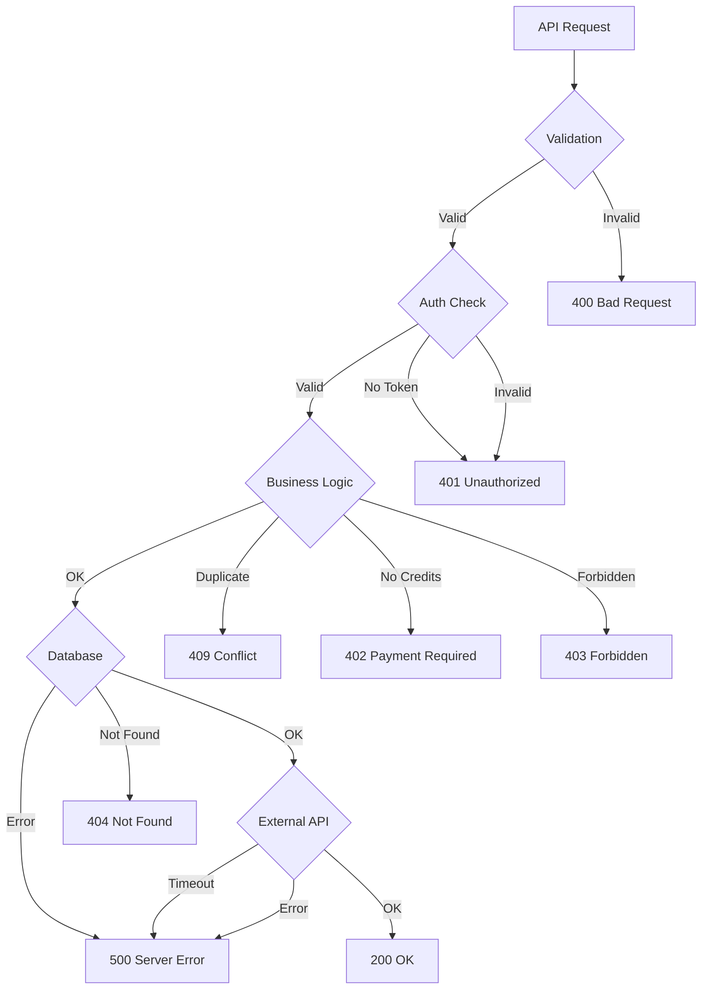

# Data Flow

End-to-end data flow documentation showing how data moves through the Anplexa platform.

## System Overview



## User Journey Data Flow

### New User (Paid Path)



### Returning User



## Data Stores

### Primary Database (PostgreSQL)



### Client-Side Storage

| Store | Data | TTL | Purpose |
|-------|------|-----|---------|
| `localStorage.accessToken` | JWT | Session | API authentication |
| `localStorage.refreshToken` | JWT | 7 days | Token refresh |
| `localStorage.user` | User JSON | Session | User state |
| `localStorage.conversations` | Conversation[] | Permanent | Offline fallback |
| `localStorage.guestMessageCount` | number | Permanent | Guest limit tracking |
| `localStorage.pathChoice` | string | 30 days | Path selection memory |
| `localStorage.theme` | string | Permanent | Theme preference |

## API Data Contracts

### Authentication

```typescript
// POST /api/auth/login
interface LoginRequest {
  email: string;
  password: string;
}

interface LoginResponse {
  accessToken: string;
  refreshToken: string;
  user: {
    id: string;
    email: string;
    isAdmin: boolean;
    personalityMode: string | null;
    subscriptionStatus: string;
  };
}
```

### Chat

```typescript
// POST /api/chat
interface ChatRequest {
  messages: {
    role: 'user' | 'assistant' | 'system';
    content: string;
  }[];
  conversationId?: string;
  preferences?: {
    responseLength: 'brief' | 'moderate' | 'detailed';
    personalityMode?: string;
  };
}

// Response: Server-Sent Events
// event: delta
// data: {"content": "token"}
//
// event: done
// data: {"messageId": "uuid"}
```

### Conversations

```typescript
// GET /api/conversations
interface ConversationsResponse {
  conversations: {
    id: string;
    title: string;
    messageCount: number;
    lastMessageAt: string;
    createdAt: string;
  }[];
}

// PUT /api/conversations/:id
interface SaveConversationRequest {
  title?: string;
  messages: {
    role: 'user' | 'assistant';
    content: string;
    createdAt: string;
  }[];
}
```

### Subscription

```typescript
// GET /api/subscription
interface SubscriptionResponse {
  status: 'active' | 'inactive' | 'trial' | 'cancelled';
  plan: 'unlimited' | 'unlimited_super' | null;
  expiresAt: string | null;
  stripeCustomerId: string | null;
}
```

## Event Flow (Analytics)

### PostHog Event Pipeline



### Key Events

| Event | Source | Properties |
|-------|--------|------------|
| `funnel_start` | Funnel | (none) |
| `persona_selected` | Funnel | persona |
| `question_answered` | Funnel | persona, questionId, answer |
| `email_submitted` | Funnel | persona, path |
| `checkout_started` | Funnel | persona, priceId |
| `checkout_completed` | Funnel | persona |
| `account_created` | Funnel | persona |
| `chat_message_sent` | Companions | conversationId, isGuest |
| `guest_limit_reached` | Companions | messageCount |
| `login_success` | Companions | method |
| `subscription_upgraded` | Companions | plan |

## Stripe Data Flow

### Checkout Flow



### Subscription Lifecycle

| Event | Trigger | Action |
|-------|---------|--------|
| `checkout.session.completed` | Payment success | Create/update customer, activate subscription |
| `customer.subscription.updated` | Plan change | Update user plan type |
| `customer.subscription.deleted` | Cancellation | Set status to cancelled |
| `invoice.payment_failed` | Payment failure | Send warning email |
| `invoice.paid` | Renewal success | Extend subscription |

## Error Handling Data Flow

### Error Response Standardization

```typescript
// All API errors follow this shape
interface ErrorResponse {
  error: string;      // User-facing message
  code?: string;      // Machine-readable code
  details?: unknown;  // Debug info (dev only)
}

// HTTP Status Codes
// 400 - Validation error
// 401 - Unauthorized (missing/invalid token)
// 402 - Payment required (credits exhausted)
// 403 - Forbidden (insufficient permissions)
// 404 - Resource not found
// 409 - Conflict (duplicate email, etc.)
// 429 - Rate limited
// 500 - Internal server error
```

### Error Flow



## Caching Strategy

### Current Implementation

| Data | Cache Location | TTL | Invalidation |
|------|----------------|-----|--------------|
| User session | In-memory | Request | - |
| Companion config | In-memory | App lifetime | Admin update |
| Rate limits | In-memory | Window | Window expiry |
| Conversations | localStorage | Permanent | Manual clear |

### Recommended Additions

| Data | Cache Location | TTL | Purpose |
|------|----------------|-----|---------|
| User sessions | Redis | 15 minutes | Distributed rate limiting |
| API responses | Redis | 5 minutes | Reduce DB load |
| Static content | CDN | 24 hours | Faster delivery |
