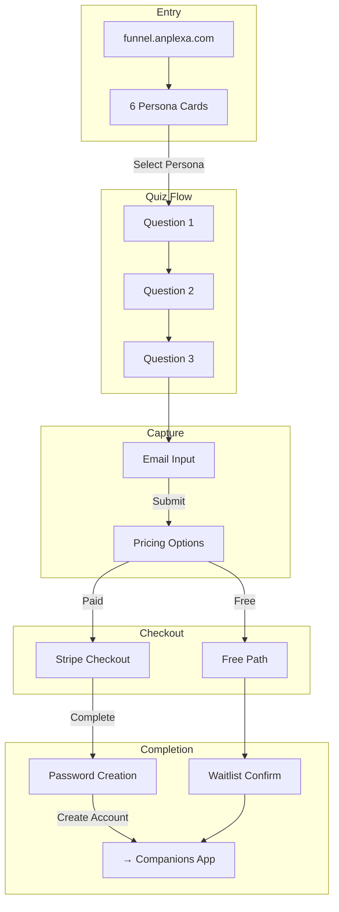
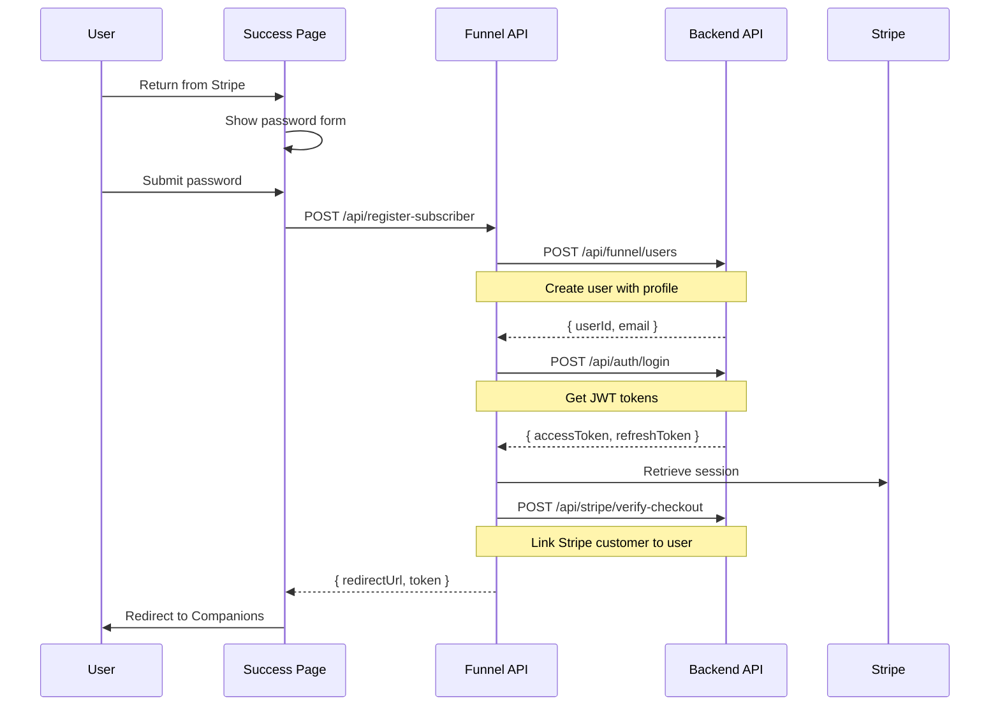

# Marketing Funnel Architecture

> **ℹ️ NEEDS UPDATE**: This guide references legacy `Funnel-Forge/` repository structure. The application is now at `apps/funnel/` in the monorepo. Directory paths and structure need updating.

Deep-dive into the funnel application architecture, conversion flow, and persona system.

## Current Architecture

The Funnel is a **full-stack monorepo** with Vite frontend and Express backend:

```
Funnel-Forge/
├── client/                   # Vite + React 19 frontend
│   ├── src/
│   │   ├── pages/           # 7 route pages
│   │   │   ├── FunnelEntry.tsx    # Persona selection
│   │   │   ├── FunnelFlow.tsx     # Quiz + checkout (450 lines) ⚠️
│   │   │   ├── Success.tsx        # Account creation
│   │   │   ├── EndScreen.tsx      # Waitlist confirmation
│   │   │   ├── Blog.tsx           # SEO content
│   │   │   └── BlogPost.tsx       # Individual posts
│   │   ├── components/      # UI components
│   │   ├── lib/             # API, analytics, data
│   │   └── hooks/           # Custom hooks
│   └── public/              # Static assets
├── server/                   # Express.js backend
│   ├── index.ts             # App entry
│   ├── routes.ts            # All routes (770 lines) ⚠️
│   ├── storage.ts           # Database abstraction
│   └── vite.ts              # Vite dev setup
└── shared/                   # Shared types
    └── schema.ts            # Drizzle schemas
```

## Persona System

### The 6 Personas (A-F)

| Persona | Name | Primary Need | Communication Style | Pace |
|---------|------|--------------|---------------------|------|
| **A** | Quietly Lonely | Connection | Gentle, patient | Slow |
| **B** | Curious/Fantasy-Open | Exploration | Open, uninhibited | Flexible |
| **C** | Privacy-First/Neuro | Safety | Structured, clear | Controlled |
| **D** | Late Night Thinker | Processing | Reflective, present | Late-night |
| **E** | Emotional Explorer | Understanding | Deep, validating | Thoughtful |
| **F** | Creative Seeker | Imagination | Dynamic, playful | Spontaneous |

### Persona Data Structure

```typescript
// client/src/lib/funnel-data.ts
interface FunnelPersona {
  id: 'A' | 'B' | 'C' | 'D' | 'E' | 'F';
  title: string;
  subtitle: string;
  emoji: string;
  questions: Question[];
  profile: PersonalityProfile;
}

interface Question {
  id: 'q1' | 'q2' | 'q3';
  text: string;
  options: {
    text: string;
    emoji: string;
  }[];
}

interface PersonalityProfile {
  primaryNeed: string;
  communicationStyle: string;
  pace: string;
  tags: string[];
}
```

## Conversion Flow



### Flow States

```typescript
type FunnelView =
  | 'questions'        // Q1, Q2, Q3
  | 'email_capture'    // Email + pricing
  | 'success'          // Payment complete
  | 'already_registered'; // Duplicate user
```

## API Architecture

### Route Structure

All routes in single file (`server/routes.ts` - 770 lines):

| Endpoint | Method | Purpose |
|----------|--------|---------|
| `/api/funnel-responses` | POST | Track question answers |
| `/api/funnel/profile` | POST | Send personality to backend |
| `/api/emails` | POST | Capture email (free path) |
| `/api/check-user-subscription` | POST | Check for duplicates |
| `/api/stripe/checkout` | GET | Create Stripe session |
| `/api/stripe/webhook` | POST | Handle Stripe events |
| `/api/register-subscriber` | POST | Create user account |

### External API Calls

```typescript
// Two helper functions for backend communication
async function callBackendAPI(endpoint: string, options: RequestInit) {
  return fetch(`${BACKEND_URL}${endpoint}`, {
    ...options,
    headers: {
      'X-API-Key': BACKEND_API_KEY,
      'Content-Type': 'application/json',
      ...options.headers,
    },
  });
}

async function callFunnelAPI(endpoint: string, options: RequestInit) {
  return fetch(`${BACKEND_URL}${endpoint}`, {
    ...options,
    headers: {
      'X-Funnel-API-Key': FUNNEL_API_KEY,
      'Content-Type': 'application/json',
      ...options.headers,
    },
  });
}
```

## Registration Flow

The most complex flow - creating a user after Stripe payment:



## Stripe Integration

### Checkout Session Creation

```typescript
// server/routes.ts
app.get('/api/stripe/checkout', async (req, res) => {
  const { email, priceId, persona } = req.query;

  // Check for existing user
  const existingUser = await checkUserExists(email);
  if (existingUser) {
    return res.status(409).json({
      error: 'Email already registered',
      loginUrl: `${FRONTEND_URL}/login`,
    });
  }

  const session = await stripe.checkout.sessions.create({
    mode: 'subscription',
    payment_method_types: ['card'],
    customer_email: email,
    line_items: [{ price: priceId, quantity: 1 }],
    success_url: `${FUNNEL_URL}/success?session_id={CHECKOUT_SESSION_ID}`,
    cancel_url: `${FUNNEL_URL}/funnel/${persona}/paid`,
    metadata: { persona, funnel_source: 'anplexa_funnel' },
  });

  res.json({ url: session.url });
});
```

### Webhook Handling

```typescript
app.post('/api/stripe/webhook', express.raw({ type: 'application/json' }), async (req, res) => {
  const sig = req.headers['stripe-signature'];

  let event;
  try {
    event = stripe.webhooks.constructEvent(req.body, sig, WEBHOOK_SECRET);
  } catch (err) {
    return res.status(400).send(`Webhook Error: ${err.message}`);
  }

  switch (event.type) {
    case 'checkout.session.completed':
      await handleCheckoutComplete(event.data.object);
      break;
    case 'customer.subscription.updated':
      await handleSubscriptionUpdate(event.data.object);
      break;
    case 'customer.subscription.deleted':
      await handleSubscriptionCancelled(event.data.object);
      break;
  }

  res.json({ received: true });
});
```

## Analytics Integration

### PostHog Events (25+)

```typescript
// client/src/lib/analytics.ts
export const trackEvents = {
  // Funnel entry
  funnelStart: () => posthog.capture('funnel_start'),
  personaSelected: (persona: string) =>
    posthog.capture('persona_selected', { persona }),

  // Quiz progression
  questionAnswered: (persona: string, questionId: string, answer: string) =>
    posthog.capture('question_answered', { persona, questionId, answer }),

  // Conversion events
  emailSubmitted: (persona: string, path: 'free' | 'paid') =>
    posthog.capture('email_submitted', { persona, path }),
  checkoutStarted: (persona: string, priceId: string) =>
    posthog.capture('checkout_started', { persona, priceId }),
  checkoutCompleted: (persona: string) =>
    posthog.capture('checkout_completed', { persona }),
  accountCreated: (persona: string) =>
    posthog.capture('account_created', { persona }),

  // User identification
  identify: (email: string, properties: object) =>
    posthog.identify(email, properties),
};
```

### Meta Pixel Integration

```typescript
// client/src/main.tsx
declare global {
  interface Window {
    fbq: (...args: any[]) => void;
  }
}

// Track page views
window.fbq('track', 'PageView');

// Track conversions
window.fbq('track', 'Lead', { content_name: persona });
window.fbq('track', 'Subscribe', { value: 11.99, currency: 'GBP' });
```

## Database Schema

```typescript
// shared/schema.ts
export const users = pgTable('users', {
  id: uuid('id').defaultRandom().primaryKey(),
  username: varchar('username', { length: 255 }).unique(),
  password: varchar('password', { length: 255 }),
  email: varchar('email', { length: 255 }),
  stripeCustomerId: varchar('stripe_customer_id', { length: 255 }),
  subscriptionStatus: varchar('subscription_status', { length: 50 })
    .default('not_subscribed'),
  planType: varchar('plan_type', { length: 50 }),
  createdAt: timestamp('created_at').defaultNow(),
});

export const emails = pgTable('emails', {
  id: uuid('id').defaultRandom().primaryKey(),
  email: varchar('email', { length: 255 }).unique(),
  funnelSource: varchar('funnel_source', { length: 100 }),
  createdAt: timestamp('created_at').defaultNow(),
});

export const funnelResponses = pgTable('funnel_responses', {
  id: uuid('id').defaultRandom().primaryKey(),
  sessionId: uuid('session_id'),
  persona: varchar('persona', { length: 10 }),
  questionId: varchar('question_id', { length: 10 }),
  answer: text('answer'),
  createdAt: timestamp('created_at').defaultNow(),
});
```

## FunnelFlow Component Analysis

### Current Issues

The `FunnelFlow.tsx` component (450 lines) manages 4 views:

```typescript
function FunnelFlow() {
  // Route params
  const { persona, type } = useParams();

  // State (10+ variables)
  const [currentStepIndex, setCurrentStepIndex] = useState(0);
  const [view, setView] = useState<FunnelView>('questions');
  const [email, setEmail] = useState('');
  const [trackedResponses, setTrackedResponses] = useState<Set<string>>(new Set());
  const [sessionId] = useState(() => crypto.randomUUID());
  // ... more state

  // Effects
  useEffect(() => { /* Track answers */ }, [currentStepIndex]);
  useEffect(() => { /* Send profile on email submit */ }, [email]);

  // Handlers (15+ functions)
  const handleAnswer = (answer: string) => { /* ... */ };
  const handleEmailSubmit = () => { /* ... */ };
  const handleCheckout = (priceId: string) => { /* ... */ };

  // Conditional rendering based on view
  if (view === 'already_registered') return <AlreadyRegistered />;
  if (view === 'success') return <PricingSection />;
  if (view === 'email_capture') return <EmailCapture />;
  return <QuestionStep />;
}
```

### Recommended Structure

```
pages/funnel/
├── FunnelFlow.tsx            # Router (< 100 lines)
├── steps/
│   ├── QuestionStep.tsx      # Question display
│   ├── EmailCaptureStep.tsx  # Email form
│   ├── PricingStep.tsx       # Plan selection
│   └── AlreadyRegisteredStep.tsx
└── hooks/
    ├── useFunnelSession.ts   # State + localStorage
    ├── useCheckout.ts        # Stripe logic
    └── usePersonaProfile.ts  # Backend API
```

## Pricing Configuration

### Current Plans

| Plan | Price | Stripe Price ID | Features |
|------|-------|-----------------|----------|
| Early Believer | £11.99/year | `price_yearly_*` | Full access, priority support |
| Monthly | £2.99/month | `price_monthly_*` | Full access |
| Free Trial | £0 | - | Limited messages, waitlist |

### Hardcoded Configuration

```typescript
// Stripe price IDs (must match across repos)
const STRIPE_PRICES = {
  MONTHLY: process.env.STRIPE_PRICE_MONTHLY,
  YEARLY: process.env.STRIPE_PRICE_YEARLY,
};
```

:::warning Sync Required
Stripe price IDs must be synchronized between Funnel and Backend. Consider moving to shared constants package.
:::

## Identified Issues & Improvements

| Issue | Severity | File | Description |
|-------|----------|------|-------------|
| Single Route File | High | `routes.ts` | 770 lines, all endpoints |
| God Component | High | `FunnelFlow.tsx` | 450 lines, 4 views |
| No State Persistence | Medium | - | Funnel state lost on refresh |
| Inconsistent Responses | Medium | `routes.ts` | Mixed response shapes |
| No Tests | High | - | Zero coverage |
| Hardcoded Prices | Low | - | Stripe IDs duplicated |

See [Funnel Improvements](/docs/improvement-plans/funnel-improvements) for the full refactoring plan.
