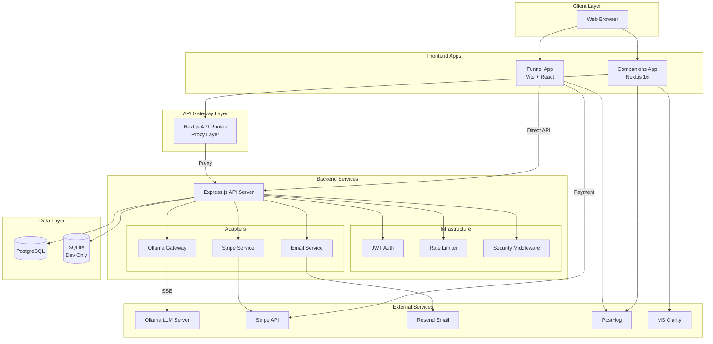
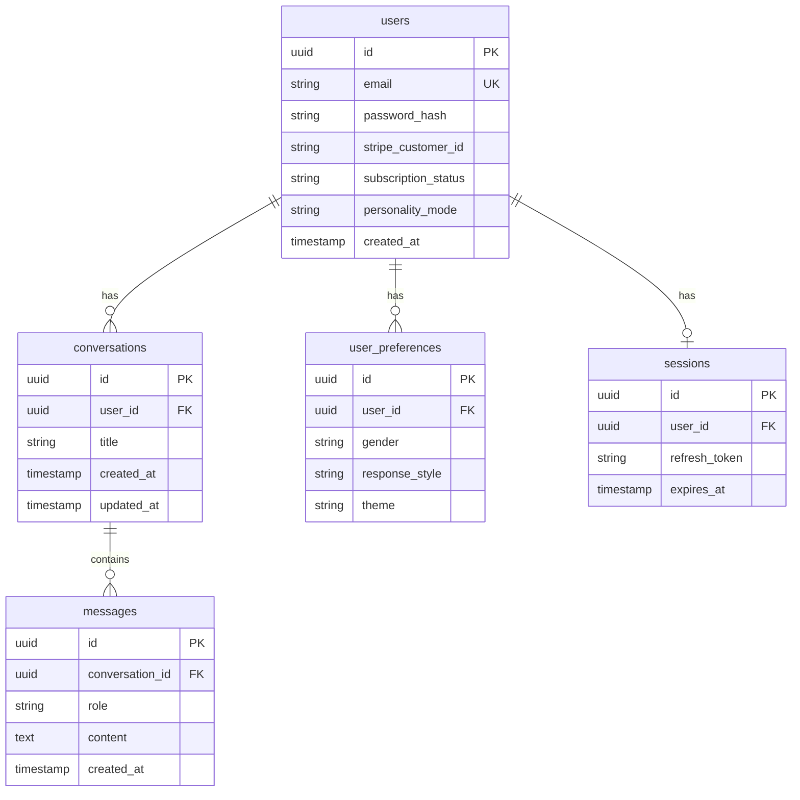
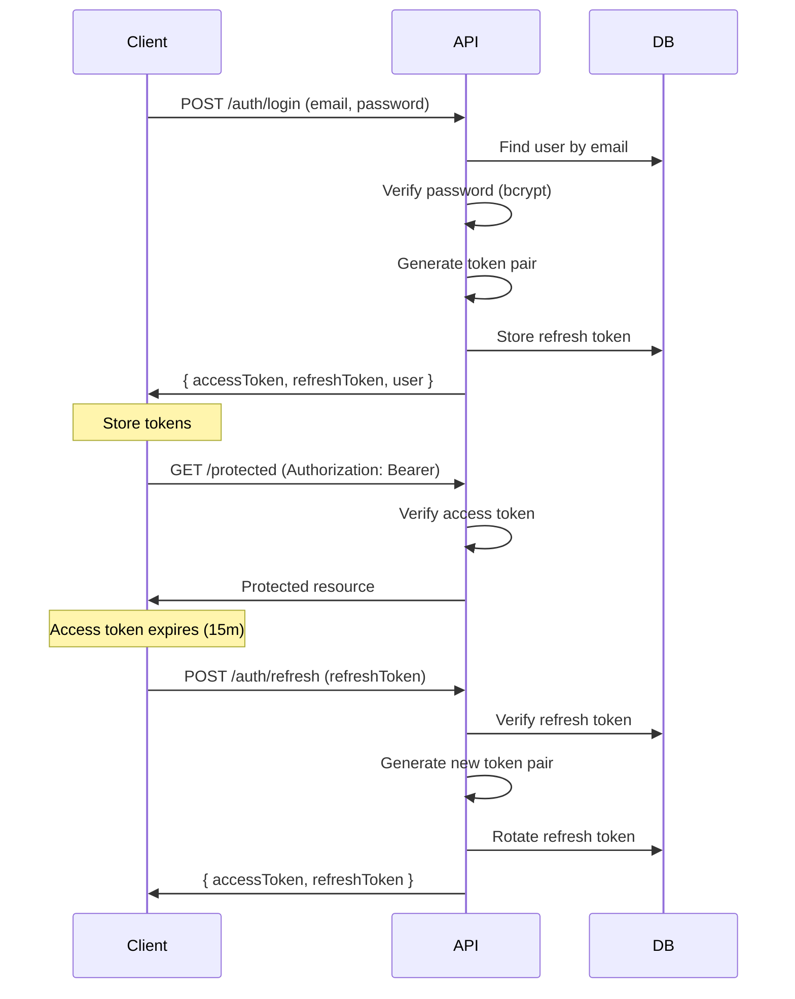
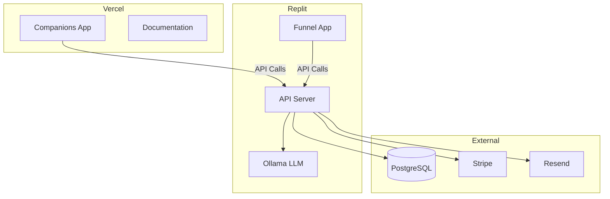

# Architecture Overview

This document provides a high-level view of the Anplexa platform architecture, including system components, communication patterns, and design decisions.

## System Architecture



## Component Responsibilities

### Funnel App (`apps/funnel`)

**Purpose**: Marketing and conversion funnel with personality-based segmentation.

| Component | Responsibility |
|-----------|----------------|
| Personality Quiz | 6 personas (A-F), 3 questions each |
| Email Capture | Waitlist and free access path |
| Stripe Checkout | Subscription payment flow |
| Success Page | Password creation, account setup |

**Key Integrations**:
- Direct API calls to backend (no proxy)
- Stripe checkout sessions
- PostHog event tracking
- Backend profile API for AI personalization

### Companions App (`apps/companions`)

**Purpose**: AI chat interface with streaming responses.

| Component | Responsibility |
|-----------|----------------|
| Chat Interface | Message display, input, ice-breakers |
| Auth Context | JWT management, subscription status |
| Conversation Service | CRUD operations, localStorage fallback |
| Settings Modal | Preferences, theme customization |

**Key Integrations**:
- Next.js API routes (proxy to backend)
- AI SDK v5 for streaming
- PostHog + Clarity analytics
- Stripe checkout (upgrade flow)

### API Server (`apps/api`)

**Purpose**: Backend services for all applications.

| Layer | Components |
|-------|------------|
| **Presentation** | Route handlers, middleware |
| **Infrastructure** | Auth (JWT), Database (Drizzle), Email (Resend) |
| **Adapters** | Ollama Gateway, Stripe Service |

**Key Features**:
- SSE streaming for chat
- JWT with refresh token rotation
- Webhook handling (Stripe)
- Admin dashboard

## Data Flow Patterns

### Request-Response (REST)
Standard REST API calls for CRUD operations:
```
Client → API Route → Handler → Database → Response
```

### Server-Sent Events (Chat)
Real-time streaming for AI responses:
```
Client → POST /api/chat → Ollama Stream → SSE Transform → Client
```

### Webhook Pattern (Stripe)
Asynchronous payment event processing:
```
Stripe Event → Webhook → Signature Verify → Handler → DB Update
```

### Token Exchange (Auth)
Secure cross-app authentication:
```
Funnel → Create Exchange Token → Redirect → Companions → Verify → JWT
```

## Database Schema Overview



## Security Architecture

### Authentication Flow



### Security Layers

| Layer | Implementation |
|-------|----------------|
| **Transport** | HTTPS enforced |
| **Headers** | Helmet.js (CSP, HSTS, etc.) |
| **CORS** | Restricted origins |
| **Rate Limiting** | Per-IP, per-endpoint |
| **Authentication** | JWT with short expiry |
| **Authorization** | Role-based (user, admin) |
| **Input Validation** | Zod schemas |
| **Password Storage** | bcrypt (12 rounds) |

## Deployment Architecture



## Technology Decisions

### Why Next.js 16 for Companions?
- Server-side rendering for SEO
- API routes as proxy layer
- React 19 features (Server Components)
- Vercel deployment integration

### Why Vite for Funnel?
- Faster development builds
- Simpler SPA architecture
- No SSR needed for conversion funnel
- Lighter bundle size

### Why Drizzle ORM?
- Type-safe queries
- PostgreSQL + SQLite support
- Lightweight (vs Prisma)
- SQL-like syntax

### Why JWT over Sessions?
- Stateless (scalable)
- Cross-app compatibility
- Mobile-ready
- Refresh token rotation for security

## Future Architecture Considerations

### Recommended Improvements

1. **Domain Layer**: Add proper business entities and use cases
2. **Event Sourcing**: Consider for conversation history
3. **Redis**: For distributed rate limiting and caching
4. **Message Queue**: For async email and webhook processing
5. **CDN**: For static assets and documentation

### Scalability Path

```
Current: Single API server
    ↓
Phase 1: Redis for sessions/rate limits
    ↓
Phase 2: Load balancer + multiple API instances
    ↓
Phase 3: Microservices (chat, auth, payments)
```
