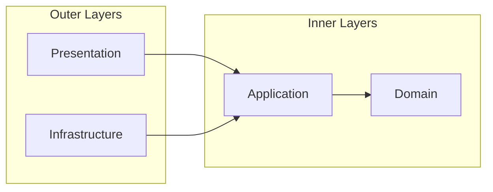

# Clean Architecture Transition Plan

A comprehensive roadmap for transforming the Anplexa platform from a monolithic structure to a layered Clean Architecture, improving testability, maintainability, and scalability.

## Executive Summary

| Metric | Current | Target |
|--------|---------|--------|
| Clean Architecture Compliance | 35% | 80%+ |
| Backend: authRoutes.ts | 985 lines | < 100 lines |
| Backend: chatRoutes.ts | 640 lines | < 100 lines |
| Frontend: ChatInterface.tsx | 949 lines | < 200 lines |
| Use Case Test Coverage | 0% | > 90% |

---

## The Dependency Rule

The fundamental principle of Clean Architecture is the **Dependency Rule**:

> Source code dependencies can only point **inward**. Inner layers know nothing about outer layers.



**Key Points:**
- Domain layer has ZERO external dependencies
- Use cases depend only on domain entities and interfaces
- Infrastructure implements interfaces defined by inner layers
- Presentation converts HTTP to use case inputs

---

## Architecture Layers

### Layer 1: Domain (Core)

**Purpose:** Enterprise business rules that would exist even without software.

**Contains:**
- **Entities** - User, Conversation, Message, Session
- **Value Objects** - Email, Password, Token, Credits
- **Repository Interfaces** - IUserRepository, IConversationRepository
- **Domain Services** - CreditService, PromptBuilder
- **Domain Errors** - AuthenticationError, ValidationError

```typescript
// domain/entities/User.ts
export class User {
  constructor(
    public readonly id: string,
    public readonly email: Email,
    private readonly passwordHash: string,
    public readonly isVerified: boolean
  ) {}

  async validatePassword(password: string): Promise<boolean> {
    return bcrypt.compare(password, this.passwordHash);
  }
}

// domain/value-objects/Email.ts
export class Email {
  private constructor(public readonly value: string) {}

  static create(email: string): Email {
    if (!this.isValid(email)) {
      throw new ValidationError('Invalid email format');
    }
    return new Email(email.toLowerCase());
  }

  private static isValid(email: string): boolean {
    return /^[^\s@]+@[^\s@]+\.[^\s@]+$/.test(email);
  }
}
```

### Layer 2: Application

**Purpose:** Application-specific business rules. Orchestrates data flow between layers.

**Contains:**
- **Use Cases** - LoginUser, RegisterUser, SendMessage
- **DTOs** - LoginRequest, LoginResponse, ChatRequest
- **Application Services** - TokenService, EmailService interfaces
- **Port Interfaces** - IAIProvider, IEmailService

```typescript
// application/use-cases/auth/LoginUser.ts
export interface LoginRequest {
  email: string;
  password: string;
}

export interface LoginResponse {
  accessToken: string;
  refreshToken: string;
  user: { id: string; email: string };
}

export class LoginUser {
  constructor(
    private readonly userRepo: IUserRepository,
    private readonly sessionRepo: ISessionRepository,
    private readonly tokenService: TokenService
  ) {}

  async execute(request: LoginRequest): Promise<LoginResponse> {
    const email = Email.create(request.email);

    const user = await this.userRepo.findByEmail(email);
    if (!user) {
      throw new AuthenticationError('Invalid credentials');
    }

    const isValid = await user.validatePassword(request.password);
    if (!isValid) {
      throw new AuthenticationError('Invalid credentials');
    }

    const accessToken = this.tokenService.generateAccessToken(user);
    const refreshToken = this.tokenService.generateRefreshToken(user);

    await this.sessionRepo.create({
      userId: user.id,
      refreshToken,
      expiresAt: this.tokenService.getRefreshExpiry()
    });

    return {
      accessToken,
      refreshToken,
      user: { id: user.id, email: user.email.value }
    };
  }
}
```

### Layer 3: Infrastructure

**Purpose:** Implements interfaces defined by inner layers. Contains all framework-specific code.

**Contains:**
- **Repository Implementations** - DrizzleUserRepository, DrizzleConversationRepository
- **External Service Adapters** - OllamaGateway, StripeService, SendGridEmailService
- **Database Configuration** - Drizzle setup, migrations
- **Framework Integrations** - Redis, external APIs

```typescript
// infrastructure/persistence/DrizzleUserRepository.ts
export class DrizzleUserRepository implements IUserRepository {
  constructor(private readonly db: Database) {}

  async findByEmail(email: Email): Promise<User | null> {
    const result = await this.db
      .select()
      .from(users)
      .where(eq(users.email, email.value))
      .limit(1);

    return result[0] ? this.toDomain(result[0]) : null;
  }

  async save(user: User): Promise<User> {
    const data = this.toPersistence(user);
    await this.db
      .insert(users)
      .values(data)
      .onConflictDoUpdate({ target: users.id, set: data });
    return user;
  }

  private toDomain(row: UsersTable): User {
    return new User(
      row.id,
      Email.create(row.email),
      row.passwordHash,
      row.isVerified
    );
  }

  private toPersistence(user: User): Partial<UsersTable> {
    return {
      id: user.id,
      email: user.email.value,
      isVerified: user.isVerified
    };
  }
}
```

### Layer 4: Presentation

**Purpose:** Converts external requests to use case inputs and formats outputs.

**Contains:**
- **HTTP Routes** - Thin route definitions (< 100 lines each)
- **Controllers** - Request/response handling
- **Validators** - Zod schemas for input validation
- **Middleware** - Auth, rate limiting, error handling

```typescript
// presentation/http/routes/authRoutes.ts
import { Router } from 'express';
import { validateRequest } from '../middleware/validateRequest';
import { loginSchema, registerSchema } from '../validators/authValidators';

export function createAuthRoutes(authController: AuthController): Router {
  const router = Router();

  router.post('/login',
    validateRequest(loginSchema),
    (req, res, next) => authController.login(req, res, next)
  );

  router.post('/register',
    validateRequest(registerSchema),
    (req, res, next) => authController.register(req, res, next)
  );

  router.post('/refresh',
    (req, res, next) => authController.refresh(req, res, next)
  );

  return router;
}

// presentation/http/controllers/AuthController.ts
export class AuthController {
  constructor(
    private readonly loginUser: LoginUser,
    private readonly registerUser: RegisterUser,
    private readonly refreshToken: RefreshToken
  ) {}

  async login(req: Request, res: Response, next: NextFunction) {
    try {
      const result = await this.loginUser.execute(req.body);
      res.json(result);
    } catch (error) {
      next(error);
    }
  }
}
```

---

## Backend Migration Plan

### Current State Analysis

| File | Lines | Issues |
|------|-------|--------|
| authRoutes.ts | 985 | Fat controller with business logic, data access, HTTP handling |
| chatRoutes.ts | 640 | Streaming logic mixed with business rules |
| stripeRoutes.ts | 472 | Webhook handling mixed with subscription logic |
| schema.ts | 677 | ORM-only, no domain behavior |

### Target Directory Structure

```
server/
├── domain/                     # Zero external dependencies
│   ├── entities/
│   │   ├── User.ts
│   │   ├── Conversation.ts
│   │   ├── Message.ts
│   │   └── Session.ts
│   ├── value-objects/
│   │   ├── Email.ts
│   │   ├── Password.ts
│   │   └── Token.ts
│   ├── repositories/           # Interfaces only
│   │   ├── IUserRepository.ts
│   │   ├── IConversationRepository.ts
│   │   └── ISessionRepository.ts
│   ├── services/
│   │   └── CreditService.ts
│   └── errors/
│       ├── DomainError.ts
│       ├── AuthenticationError.ts
│       └── ValidationError.ts
│
├── application/                # Depends only on domain
│   ├── use-cases/
│   │   ├── auth/
│   │   │   ├── LoginUser.ts
│   │   │   ├── RegisterUser.ts
│   │   │   ├── RefreshToken.ts
│   │   │   └── ResetPassword.ts
│   │   ├── chat/
│   │   │   ├── SendMessage.ts
│   │   │   └── GetConversationHistory.ts
│   │   └── subscription/
│   │       └── CreateCheckout.ts
│   ├── dto/
│   │   ├── auth/
│   │   └── chat/
│   └── services/
│       ├── TokenService.ts
│       └── IEmailService.ts
│
├── infrastructure/             # Implements domain interfaces
│   ├── persistence/
│   │   ├── drizzle/
│   │   │   ├── DrizzleUserRepository.ts
│   │   │   └── DrizzleConversationRepository.ts
│   │   └── redis/
│   │       └── RedisSessionRepository.ts
│   ├── external/
│   │   ├── ai/
│   │   │   └── OllamaGateway.ts
│   │   ├── email/
│   │   │   └── SendGridEmailService.ts
│   │   └── payment/
│   │       └── StripeService.ts
│   └── config/
│       └── container.ts        # DI setup
│
└── presentation/               # HTTP layer only
    ├── http/
    │   ├── routes/
    │   │   ├── authRoutes.ts   # < 100 lines
    │   │   ├── chatRoutes.ts   # < 100 lines
    │   │   └── index.ts
    │   ├── controllers/
    │   │   ├── AuthController.ts
    │   │   └── ChatController.ts
    │   └── middleware/
    │       ├── authMiddleware.ts
    │       ├── errorHandler.ts
    │       └── rateLimiter.ts
    └── validators/
        ├── authValidators.ts
        └── chatValidators.ts
```

### Use Case Extractions

#### LoginUser Extraction

**Before (in authRoutes.ts):**
```typescript
router.post('/login', async (req, res) => {
  try {
    const { email, password } = req.body;
    if (!email || !password) {
      return res.status(400).json({ error: 'Missing fields' });
    }
    const user = await db.select().from(users).where(eq(users.email, email));
    if (!user) {
      return res.status(401).json({ error: 'Invalid credentials' });
    }
    const isValid = await bcrypt.compare(password, user.passwordHash);
    if (!isValid) {
      return res.status(401).json({ error: 'Invalid credentials' });
    }
    const token = jwt.sign({ userId: user.id }, process.env.JWT_SECRET);
    // ... more logic
    res.json({ token, user });
  } catch (error) {
    res.status(500).json({ error: 'Server error' });
  }
});
```

**After:**
- **Domain Entity** - User with validatePassword method
- **Use Case** - LoginUser with execute method
- **Controller** - AuthController.login (thin)
- **Route** - Single line route definition

#### SendMessage Extraction

**Before (in chatRoutes.ts):**
```typescript
router.post('/chat', async (req, res) => {
  try {
    // 300+ lines of:
    // - Auth check
    // - Credit validation
    // - Message formatting
    // - Ollama API call
    // - SSE streaming
    // - Conversation saving
    // - Error handling
  } catch (error) {
    res.status(500).json({ error: 'Server error' });
  }
});
```

**After:**
- **Use Case** - SendMessage orchestrates the flow
- **Domain** - Conversation, Message entities
- **Infrastructure** - OllamaGateway implements IAIProvider
- **Presentation** - ChatController handles SSE setup

---

## Frontend Migration Plan

### Current State Analysis

| Component | Lines | Issues |
|-----------|-------|--------|
| ChatInterface.tsx | 949 | God component, 12+ useEffect hooks |
| auth-context.tsx | 300+ | Mixed concerns, direct API calls |
| conversation-service.ts | 463 | Duplicate of domain entities |

### Target Component Structure

```
components/
├── chat/
│   ├── ChatInterface.tsx       # < 200 lines - orchestration only
│   ├── MessageList.tsx         # Message rendering
│   ├── MessageItem.tsx         # Single message
│   ├── MessageInput.tsx        # Input with send button
│   ├── TypingIndicator.tsx     # AI typing indicator
│   ├── ConversationHeader.tsx  # Title, actions
│   └── index.ts                # Barrel export
│
├── auth/
│   ├── AuthForm.tsx            # Login/register form
│   ├── LoginForm.tsx           # Login specific
│   ├── RegisterForm.tsx        # Register specific
│   └── index.ts
│
└── settings/
    ├── SettingsModal.tsx       # Main modal
    ├── ProfileSettings.tsx     # Profile section
    └── AppearanceSettings.tsx  # Theme section

hooks/
├── useChat.ts                  # Chat state and operations
├── useConversation.ts          # Conversation management
├── useGuestMode.ts             # Guest mode logic
├── useScrollToBottom.ts        # Scroll behavior
└── index.ts

services/
├── api/
│   ├── client.ts               # API client setup
│   ├── auth.ts                 # Auth API calls
│   ├── chat.ts                 # Chat API calls
│   └── conversations.ts        # Conversation API calls
└── storage/
    ├── tokens.ts               # Token storage
    └── preferences.ts          # User preferences
```

### Hook Extraction Examples

#### useChat Hook

```typescript
// hooks/useChat.ts
interface UseChatReturn {
  messages: Message[];
  isLoading: boolean;
  error: Error | null;
  sendMessage: (content: string) => Promise<void>;
  retryMessage: (messageId?: string) => Promise<void>;
  clearError: () => void;
}

export function useChat(conversationId?: string): UseChatReturn {
  const [messages, setMessages] = useState<Message[]>([]);
  const [isLoading, setIsLoading] = useState(false);
  const [error, setError] = useState<Error | null>(null);

  const sendMessage = useCallback(async (content: string) => {
    if (!content.trim() || isLoading) return;

    const userMessage = createMessage('user', content);
    setMessages(prev => [...prev, userMessage]);
    setIsLoading(true);

    try {
      const response = await chatService.sendMessage({
        conversationId,
        content
      });

      // Handle streaming response
      for await (const chunk of response) {
        setMessages(prev => appendToLastMessage(prev, chunk));
      }
    } catch (err) {
      setError(err instanceof Error ? err : new Error('Failed to send'));
      setMessages(prev => prev.filter(m => m.id !== userMessage.id));
    } finally {
      setIsLoading(false);
    }
  }, [conversationId, isLoading]);

  return { messages, isLoading, error, sendMessage, retryMessage, clearError };
}
```

#### useConversation Hook

```typescript
// hooks/useConversation.ts
interface UseConversationReturn {
  conversations: Conversation[];
  currentConversation: Conversation | null;
  isLoading: boolean;
  selectConversation: (id: string) => void;
  createConversation: (title?: string) => Promise<Conversation>;
  deleteConversation: (id: string) => Promise<void>;
}

export function useConversation(): UseConversationReturn {
  const [conversations, setConversations] = useState<Conversation[]>([]);
  const [currentId, setCurrentId] = useState<string | null>(null);
  const [isLoading, setIsLoading] = useState(true);

  const currentConversation = useMemo(
    () => conversations.find(c => c.id === currentId) ?? null,
    [conversations, currentId]
  );

  // Load, select, create, delete methods...

  return {
    conversations,
    currentConversation,
    isLoading,
    selectConversation: setCurrentId,
    createConversation,
    deleteConversation
  };
}
```

### Simplified ChatInterface

```typescript
// components/chat/ChatInterface.tsx (< 200 lines)
export function ChatInterface() {
  const { user, isGuest } = useAuth();
  const { messages, isLoading, error, sendMessage, clearError } = useChat();
  const { conversations, currentConversation, selectConversation } = useConversation();

  return (
    <div className="flex h-full">
      <ConversationSidebar
        conversations={conversations}
        currentId={currentConversation?.id}
        onSelect={selectConversation}
      />

      <div className="flex flex-1 flex-col">
        <ConversationHeader conversation={currentConversation} />

        {error && <ErrorBanner message={error.message} onDismiss={clearError} />}

        <MessageList messages={messages} isLoading={isLoading} />

        <MessageInput onSend={sendMessage} isLoading={isLoading} />
      </div>
    </div>
  );
}
```

---

## Implementation Phases

### Phase 1: Foundation

**Tasks:**
1. Create directory structure (domain/, application/, infrastructure/, presentation/)
2. Set up base error classes (DomainError, ValidationError, AuthenticationError)
3. Configure dependency injection container (tsyringe)
4. Create repository interfaces (IUserRepository, IConversationRepository)
5. Set up barrel exports (index.ts files)
6. Add path aliases to tsconfig

### Phase 2: Auth Domain Extraction

**Tasks:**
1. Create User entity with validatePassword method
2. Create Email and Password value objects with validation
3. Extract LoginUser use case from authRoutes.ts
4. Extract RegisterUser use case
5. Extract RefreshToken use case
6. Implement DrizzleUserRepository
7. Create AuthController (thin)
8. Add unit tests for auth use cases
9. Wire up DI container

### Phase 3: Chat Domain Extraction

**Tasks:**
1. Create Conversation and Message entities
2. Create IAIProvider interface
3. Extract SendMessage use case with streaming support
4. Extract GetConversationHistory use case
5. Implement DrizzleConversationRepository
6. Refactor OllamaGateway to implement IAIProvider
7. Create ChatController
8. Add integration tests for chat flow

### Phase 4: Frontend Refactor

**Tasks:**
1. Extract useChat hook from ChatInterface
2. Extract useConversation hook
3. Extract useGuestMode hook
4. Create MessageList and MessageItem components
5. Create MessageInput component
6. Refactor ChatInterface to orchestrator only (< 200 lines)
7. Create service layer (authService, chatService, conversationService)
8. Refactor AuthContext to use adapter pattern
9. Add error boundaries
10. Add unit tests for hooks with React Testing Library

---

## Dependency Injection Setup

```typescript
// infrastructure/config/container.ts
import { container } from 'tsyringe';

// Repositories
container.registerSingleton<IUserRepository>(
  'IUserRepository',
  DrizzleUserRepository
);
container.registerSingleton<IConversationRepository>(
  'IConversationRepository',
  DrizzleConversationRepository
);
container.registerSingleton<ISessionRepository>(
  'ISessionRepository',
  DrizzleSessionRepository
);

// External Services
container.registerSingleton<IAIProvider>(
  'IAIProvider',
  OllamaGateway
);
container.registerSingleton<IEmailService>(
  'IEmailService',
  SendGridEmailService
);

// Application Services
container.registerSingleton(TokenService);

// Use Cases
container.register(LoginUser, {
  useFactory: (c) => new LoginUser(
    c.resolve('IUserRepository'),
    c.resolve('ISessionRepository'),
    c.resolve(TokenService)
  )
});

// Controllers
container.register(AuthController, {
  useFactory: (c) => new AuthController(
    c.resolve(LoginUser),
    c.resolve(RegisterUser),
    c.resolve(RefreshToken)
  )
});
```

---

## Testing Strategy

### Unit Testing Use Cases

```typescript
// tests/unit/application/use-cases/auth/LoginUser.test.ts
describe('LoginUser', () => {
  let loginUser: LoginUser;
  let mockUserRepo: jest.Mocked<IUserRepository>;
  let mockSessionRepo: jest.Mocked<ISessionRepository>;
  let mockTokenService: jest.Mocked<TokenService>;

  beforeEach(() => {
    mockUserRepo = createMock<IUserRepository>();
    mockSessionRepo = createMock<ISessionRepository>();
    mockTokenService = createMock<TokenService>();

    loginUser = new LoginUser(mockUserRepo, mockSessionRepo, mockTokenService);
  });

  it('should return tokens on valid credentials', async () => {
    const user = createTestUser({ email: 'test@example.com' });
    mockUserRepo.findByEmail.mockResolvedValue(user);
    mockTokenService.generateAccessToken.mockReturnValue('access-token');
    mockTokenService.generateRefreshToken.mockReturnValue('refresh-token');

    const result = await loginUser.execute({
      email: 'test@example.com',
      password: 'validPassword123'
    });

    expect(result.accessToken).toBe('access-token');
    expect(result.refreshToken).toBe('refresh-token');
    expect(mockSessionRepo.create).toHaveBeenCalled();
  });

  it('should throw on invalid email', async () => {
    mockUserRepo.findByEmail.mockResolvedValue(null);

    await expect(loginUser.execute({
      email: 'nonexistent@example.com',
      password: 'password'
    })).rejects.toThrow(AuthenticationError);
  });

  it('should throw on invalid password', async () => {
    const user = createTestUser();
    mockUserRepo.findByEmail.mockResolvedValue(user);
    jest.spyOn(user, 'validatePassword').mockResolvedValue(false);

    await expect(loginUser.execute({
      email: 'test@example.com',
      password: 'wrongPassword'
    })).rejects.toThrow(AuthenticationError);
  });
});
```

### Integration Testing

```typescript
// tests/integration/api/auth.test.ts
describe('Auth API', () => {
  let app: Express;
  let testDb: Database;

  beforeAll(async () => {
    testDb = await createTestDatabase();
    app = createApp(testDb);
  });

  afterAll(async () => {
    await testDb.close();
  });

  describe('POST /api/auth/login', () => {
    it('should return tokens for valid credentials', async () => {
      await createTestUser(testDb, {
        email: 'test@example.com',
        password: 'password123'
      });

      const response = await request(app)
        .post('/api/auth/login')
        .send({ email: 'test@example.com', password: 'password123' });

      expect(response.status).toBe(200);
      expect(response.body).toHaveProperty('accessToken');
      expect(response.body).toHaveProperty('refreshToken');
    });
  });
});
```

---

## Success Metrics

### Backend

| Metric | Before | After | Change |
|--------|--------|-------|--------|
| authRoutes.ts lines | 985 | < 100 | -90% |
| chatRoutes.ts lines | 640 | < 100 | -85% |
| Use case test coverage | 0% | > 90% | +90% |
| Cyclomatic complexity | 15+ | < 10 | -33% |
| Repository abstraction | None | Complete | ✓ |
| Dependency injection | None | Full | ✓ |

### Frontend

| Metric | Before | After | Change |
|--------|--------|-------|--------|
| ChatInterface.tsx lines | 949 | < 200 | -79% |
| Largest component | 949 | < 200 | -79% |
| Custom hooks | 0 | 5+ | +5 |
| Service layer | None | Complete | ✓ |
| Test coverage | < 10% | > 70% | +60% |

### Overall

| Metric | Before | After |
|--------|--------|-------|
| Clean Architecture Compliance | 35% | 80%+ |
| Domain layer dependencies | N/A | Zero |
| Testable use cases | 0 | All |
| Repository pattern | None | Complete |

---

## Interactive Documentation

For a visual, interactive version of this plan, see:
- [Clean Architecture Transition (Interactive HTML)](/clean-architecture-transition.html)

---

## Related Documentation

- [Backend Improvements](./backend-improvements.md) - Detailed backend refactoring
- [Frontend Improvements](./frontend-improvements.md) - Component decomposition details
- [Monorepo Migration](./monorepo-migration.md) - Consolidation plan
- [Improvement Roadmap](./roadmap.md) - Overall timeline
