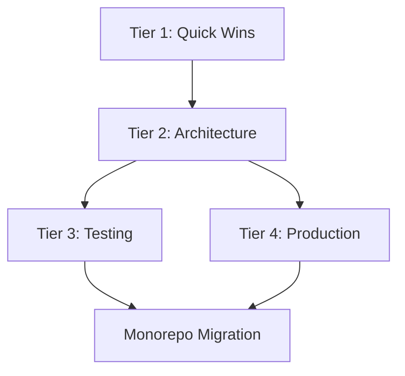

# Improvement Roadmap

This roadmap outlines the strategic improvement plan for the Anplexa platform, organized into tiers based on impact, complexity, and dependencies.

## Overview

The improvement plan is organized into four tiers, each building upon the previous. This approach ensures we maintain a working system while progressively enhancing architecture, reliability, and maintainability.

## Tier Structure

### Tier 1: Quick Wins

Low-effort, high-impact improvements that can be implemented immediately without major refactoring.

| Area | Improvement | Effort | Impact |
|------|-------------|--------|--------|
| Backend | Add request validation with Zod schemas | Low | High |
| Backend | Standardize API response format | Low | Medium |
| Backend | Add structured logging with correlation IDs | Low | High |
| Frontend | Extract custom hooks from ChatInterface | Medium | High |
| Frontend | Add error boundaries around major components | Low | Medium |
| Funnel | Implement localStorage state persistence | Low | Medium |
| All | Add TypeScript strict mode | Medium | High |

### Tier 2: Architecture Refactoring

Structural improvements to establish clean architecture patterns and better separation of concerns.

| Area | Improvement | Effort | Impact |
|------|-------------|--------|--------|
| Backend | Extract use cases from route handlers | High | Critical |
| Backend | Introduce repository pattern for data access | High | High |
| Backend | Create domain layer with entities and value objects | Medium | High |
| Frontend | Decompose ChatInterface into focused components | High | High |
| Frontend | Implement adapter pattern for auth context | Medium | High |
| Funnel | Extract route handlers from monolithic routes.ts | High | High |
| Funnel | Split FunnelFlow into step components | Medium | High |

### Tier 3: Testing Infrastructure

Build comprehensive testing coverage to enable confident refactoring and deployment.

| Area | Test Type | Coverage Target | Priority |
|------|-----------|-----------------|----------|
| Backend | Unit tests for use cases | 90%+ | Critical |
| Backend | Integration tests for API routes | 80%+ | High |
| Backend | Repository mocks and test fixtures | N/A | High |
| Frontend | Component unit tests | 80%+ | High |
| Frontend | Hook testing with React Testing Library | 90%+ | High |
| E2E | Critical user flows | 100% | Critical |
| E2E | Authentication flows | 100% | Critical |

### Tier 4: Production Hardening

Prepare the platform for production scale with observability, performance, and reliability improvements.

| Area | Improvement | Effort | Impact |
|------|-------------|--------|--------|
| Infrastructure | Implement health check endpoints | Low | Critical |
| Infrastructure | Add metrics collection (Prometheus/DataDog) | Medium | High |
| Infrastructure | Set up distributed tracing | Medium | High |
| Backend | Implement rate limiting | Medium | High |
| Backend | Add circuit breakers for external services | Medium | High |
| Frontend | Implement performance monitoring | Low | Medium |
| All | Security audit and hardening | High | Critical |

## Priority Matrix

```
                    HIGH IMPACT
                        │
    ┌───────────────────┼───────────────────┐
    │                   │                   │
    │   Quick Wins      │   Do First        │
    │   (Tier 1)        │   (Tier 2 Core)   │
    │                   │                   │
LOW ├───────────────────┼───────────────────┤ HIGH
EFFORT                  │                   EFFORT
    │                   │                   │
    │   Skip/Defer      │   Plan Carefully  │
    │                   │   (Tier 3, 4)     │
    │                   │                   │
    └───────────────────┼───────────────────┘
                        │
                    LOW IMPACT
```

### Priority Ranking

1. **Critical** - Block deployment or create significant risk
2. **High** - Major impact on maintainability or user experience
3. **Medium** - Notable improvement but not blocking
4. **Low** - Nice to have, can be deferred

## Timeline Guidance

### Phase 1: Foundation (2-4 weeks)

- Complete all Tier 1 quick wins
- Begin Tier 2 backend use case extraction
- Set up testing infrastructure scaffolding

### Phase 2: Architecture (4-8 weeks)

- Complete backend Clean Architecture migration
- Complete frontend component decomposition
- Complete funnel route extraction
- Achieve 60% test coverage

### Phase 3: Quality (4-6 weeks)

- Complete Tier 3 testing infrastructure
- Achieve 80%+ coverage targets
- Begin monorepo migration planning

### Phase 4: Production (4-6 weeks)

- Complete Tier 4 production hardening
- Execute monorepo migration
- Set up CI/CD pipelines for monorepo

## Key Metrics to Track

### Code Quality Metrics

| Metric | Current | Target | Measurement |
|--------|---------|--------|-------------|
| Largest file size | 985 LOC | < 300 LOC | ESLint max-lines |
| Cyclomatic complexity | High | < 10/function | ESLint complexity |
| TypeScript strict | Partial | Full | tsconfig strict |
| Test coverage | < 20% | > 80% | Jest/Vitest coverage |

### Technical Debt Metrics

| Metric | Description | Target |
|--------|-------------|--------|
| Route handler size | Lines per route handler | < 50 LOC |
| Component size | Lines per React component | < 200 LOC |
| Dependency depth | Max import chain depth | < 4 levels |
| Circular dependencies | Number of circular imports | 0 |

### Performance Metrics

| Metric | Current | Target | Tool |
|--------|---------|--------|------|
| API response time (p95) | TBD | < 200ms | APM |
| Frontend bundle size | TBD | < 250KB gzipped | Webpack analyzer |
| Time to interactive | TBD | < 3s | Lighthouse |
| Memory usage | TBD | < 512MB | Runtime monitoring |

### Reliability Metrics

| Metric | Target | Measurement |
|--------|--------|-------------|
| API availability | 99.9% | Uptime monitoring |
| Error rate | < 0.1% | Error tracking |
| Mean time to recovery | < 15 min | Incident tracking |

## Success Criteria

### Tier 1 Complete When:
- All route handlers use Zod validation
- Standardized response format across all APIs
- Correlation IDs present in all logs
- Error boundaries wrap all major component trees

### Tier 2 Complete When:
- No route handler exceeds 50 lines
- All business logic lives in use cases
- Repository pattern used for all data access
- ChatInterface split into 5+ focused components

### Tier 3 Complete When:
- Unit test coverage > 80%
- Integration test coverage > 80%
- E2E tests cover all critical flows
- Tests run in CI on every PR

### Tier 4 Complete When:
- Health checks return meaningful status
- Metrics available in monitoring dashboard
- Distributed tracing enabled
- Rate limiting protects all public endpoints

## Dependencies



## Next Steps

1. Review and prioritize specific items within each tier
2. Assign ownership for each major initiative
3. Create tracking issues/tickets for each improvement
4. Begin Tier 1 quick wins immediately
5. Plan Tier 2 architecture work in sprints

---

See individual improvement plans for detailed guidance:
- [Clean Architecture Transition](./clean-architecture-transition.md) - Comprehensive migration plan
- [Backend Improvements](./backend-improvements.md)
- [Frontend Improvements](./frontend-improvements.md)
- [Funnel Improvements](./funnel-improvements.md)
- [Monorepo Migration](./monorepo-migration.md)

## Interactive Documentation

For visual, interactive versions of these plans:
- [User Flows Interactive](/user-flows-interactive.html) - All user flows with step-by-step diagrams
- [Clean Architecture Transition](/clean-architecture-transition.html) - Visual migration plan
