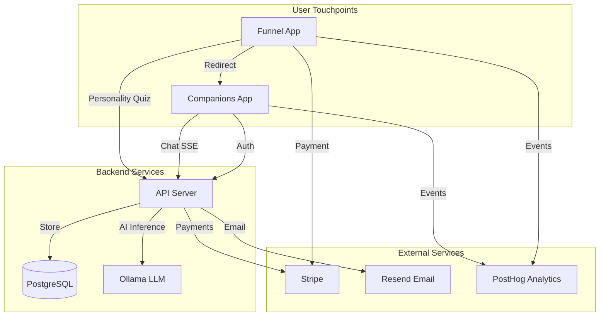

# Anplexa Platform Documentation

Welcome to the technical documentation for **Anplexa**, an AI companion platform that provides personalized, NSFW-friendly AI chat experiences.

## Platform Overview

Anplexa consists of three main applications:

| Application | Purpose | Tech Stack | Repository |
|-------------|---------|------------|------------|
| **API** | Backend services | Express.js, TypeScript, Drizzle ORM | `apps/api` |
| **Companions** | AI chat interface | Next.js 16, React 19, AI SDK v5 | `apps/companions` |
| **Funnel** | Marketing & conversion | Vite, React 19, Express.js | `apps/funnel` |

## Architecture at a Glance



## Quick Links

### For Developers
- [Getting Started](/docs/development/getting-started) - Set up your local environment
- [Environment Setup](/docs/development/environment-setup) - Configure environment variables
- [API Reference](/docs/api/authentication) - Complete API documentation

### For Architects
- [Architecture Overview](/docs/architecture/overview) - System design and patterns
- [Data Flow](/docs/architecture/data-flow) - How data moves through the system
- [Improvement Roadmap](/docs/improvement-plans/roadmap) - Future enhancements

### For Security
- [Security Overview](/docs/security/overview) - Security model and best practices
- [Authentication Security](/docs/security/authentication-security) - JWT and token handling

## Key Features

### AI Chat (Companions App)
- Real-time streaming responses via Server-Sent Events (SSE)
- Multiple personality modes (playful, thoughtful, creative)
- Guest mode with 6 free messages
- Conversation persistence and history
- Response length preferences (brief, moderate, detailed)

### Conversion Funnel
- 6 personality-based user segments (A-F)
- 3-question personality quiz
- Stripe integration for subscriptions
- Magic link authentication
- Exchange token flow for secure redirects

### Backend API
- JWT-based authentication with refresh tokens
- Admin dashboard for companion configuration
- Stripe webhook handling
- Email service via Resend
- Rate limiting and security headers

## Repository Structure

```
anplexa/
├── apps/
│   ├── api/                  # Backend API (Express.js)
│   ├── companions/           # AI Chat App (Next.js)
│   └── funnel/               # Marketing Funnel (Vite + Express)
├── packages/
│   ├── shared/               # Shared types, validation, constants
│   ├── ui/                   # Shared UI components
│   └── domain/               # Shared domain entities
├── docs/                     # This documentation (Docusaurus)
└── tools/                    # Build scripts, shared tooling
```

## Technology Stack

| Layer | Technology |
|-------|------------|
| **Frontend** | React 19, Next.js 16, Vite, Tailwind CSS v4 |
| **Backend** | Express.js, TypeScript |
| **Database** | PostgreSQL, Drizzle ORM |
| **AI** | Ollama (self-hosted LLMs) |
| **Payments** | Stripe |
| **Email** | Resend |
| **Analytics** | PostHog, Microsoft Clarity |
| **Auth** | JWT with refresh tokens |
| **Testing** | Vitest, Playwright |

## Interactive Documentation

For visual, interactive documentation with step-by-step diagrams:

- [User Flows Interactive](/user-flows-interactive.html) - 35 user flows across 5 categories
- [Clean Architecture Transition](/clean-architecture-transition.html) - Visual migration plan

## Getting Help

- Check the [API Reference](/docs/api/authentication) for endpoint documentation
- Review [User Flows](/docs/user-flows/authentication) for sequence diagrams
- See [Improvement Plans](/docs/improvement-plans/roadmap) for future development
- View the [Clean Architecture Plan](/docs/improvement-plans/clean-architecture-transition) for detailed migration steps

---

**Version**: 1.0.0
**Last Updated**: January 2025
