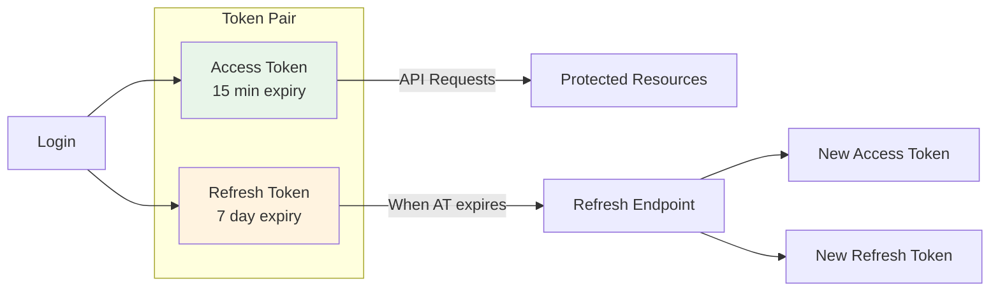
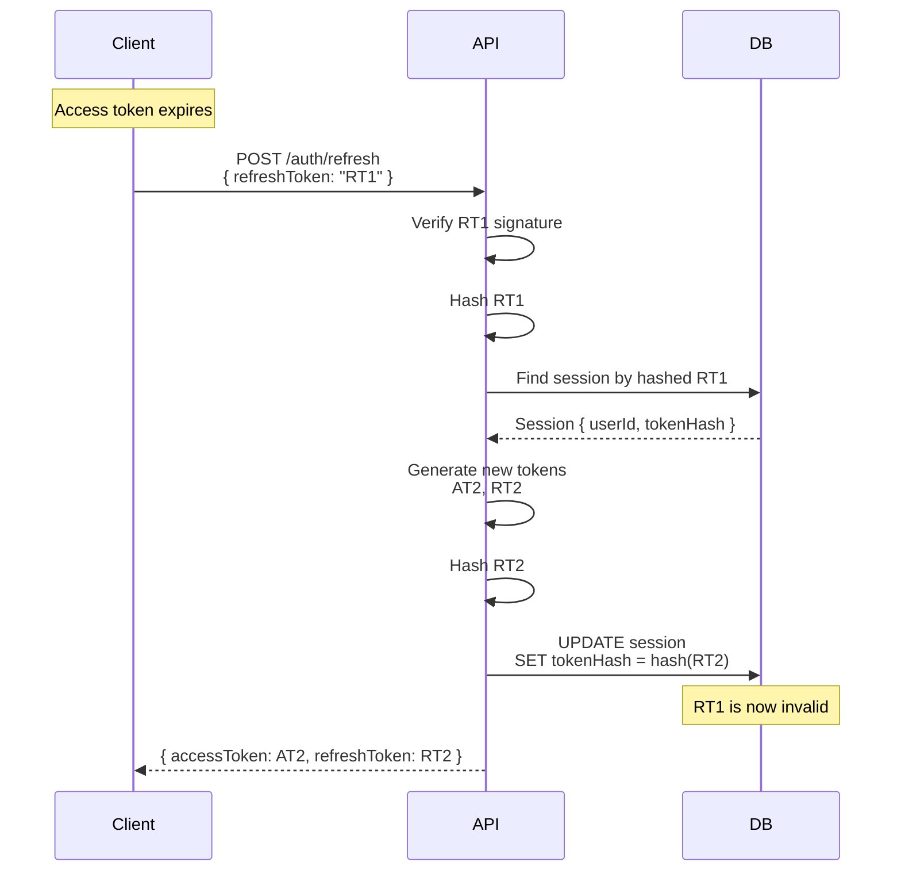
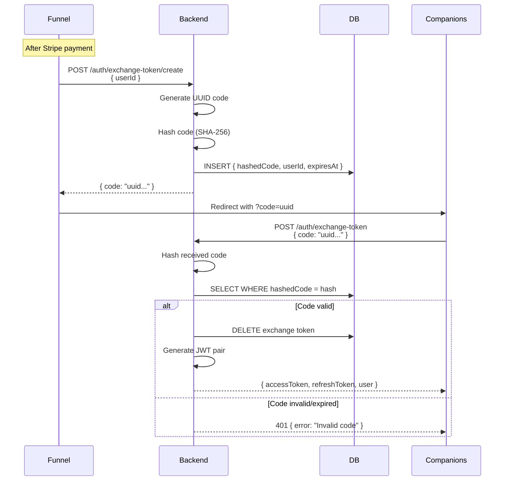

# Authentication Security

This document provides detailed security documentation for the Anplexa authentication system, including JWT implementation, token storage, password handling, and security best practices.

## JWT Implementation

### Overview

Anplexa uses JSON Web Tokens (JWT) for stateless authentication with a dual-token strategy.



### Token Specifications

#### Access Token

| Property | Value |
|----------|-------|
| **Algorithm** | HS256 (HMAC-SHA256) |
| **Expiry** | 15 minutes |
| **Purpose** | Authorize API requests |
| **Storage** | Client-side (localStorage) |
| **Rotation** | Not rotated |

**Payload Structure**:
```json
{
  "sub": "550e8400-e29b-41d4-a716-446655440000",
  "email": "user@example.com",
  "isAdmin": false,
  "type": "access",
  "iat": 1704720000,
  "exp": 1704720900
}
```

#### Refresh Token

| Property | Value |
|----------|-------|
| **Algorithm** | HS256 (HMAC-SHA256) |
| **Expiry** | 7 days |
| **Purpose** | Obtain new access tokens |
| **Storage** | Client (localStorage) + Server (hashed in DB) |
| **Rotation** | Rotated on each use |

**Payload Structure**:
```json
{
  "sub": "550e8400-e29b-41d4-a716-446655440000",
  "email": "user@example.com",
  "isAdmin": false,
  "type": "refresh",
  "sessionId": "a1b2c3d4-e5f6-7890-abcd-ef1234567890",
  "iat": 1704720000,
  "exp": 1705324800
}
```

### JWT Signing

```typescript
import jwt from 'jsonwebtoken';

const JWT_SECRET = process.env.JWT_SECRET; // 256-bit minimum

// Generate access token
function generateAccessToken(user: User): string {
  return jwt.sign(
    {
      sub: user.id,
      email: user.email,
      isAdmin: user.isAdmin,
      type: 'access',
    },
    JWT_SECRET,
    { expiresIn: '15m' }
  );
}

// Generate refresh token
function generateRefreshToken(user: User, sessionId: string): string {
  return jwt.sign(
    {
      sub: user.id,
      email: user.email,
      isAdmin: user.isAdmin,
      type: 'refresh',
      sessionId,
    },
    JWT_SECRET,
    { expiresIn: '7d' }
  );
}
```

### JWT Verification

```typescript
import jwt, { JwtPayload } from 'jsonwebtoken';

function verifyToken(token: string, expectedType: 'access' | 'refresh'): JwtPayload {
  try {
    const decoded = jwt.verify(token, JWT_SECRET) as JwtPayload;

    // Verify token type
    if (decoded.type !== expectedType) {
      throw new Error('Invalid token type');
    }

    return decoded;
  } catch (error) {
    if (error instanceof jwt.TokenExpiredError) {
      throw new AuthError('Token expired', 'TOKEN_EXPIRED');
    }
    if (error instanceof jwt.JsonWebTokenError) {
      throw new AuthError('Invalid token', 'TOKEN_INVALID');
    }
    throw error;
  }
}
```

---

## Token Storage

### Current Implementation

| Token | Client Storage | Server Storage | Security Concern |
|-------|----------------|----------------|------------------|
| Access Token | localStorage | None | XSS vulnerable |
| Refresh Token | localStorage | Hashed in `sessions` table | XSS vulnerable |

### XSS Vulnerability Analysis

**Attack Scenario**:
1. Attacker injects malicious script via XSS
2. Script executes: `localStorage.getItem('accessToken')`
3. Token sent to attacker's server
4. Attacker impersonates user

**Current Mitigations**:
- Short access token expiry (15 min) limits window
- Refresh token rotation invalidates stolen tokens after first use
- CSP headers prevent inline scripts
- React's auto-escaping prevents most XSS

### Recommended: HttpOnly Cookies

```typescript
// Server-side token setting
function setAuthCookies(res: Response, accessToken: string, refreshToken: string) {
  // Access token cookie
  res.cookie('accessToken', accessToken, {
    httpOnly: true,          // Not accessible via JavaScript
    secure: true,            // HTTPS only
    sameSite: 'strict',      // CSRF protection
    maxAge: 15 * 60 * 1000,  // 15 minutes
    path: '/',
  });

  // Refresh token cookie
  res.cookie('refreshToken', refreshToken, {
    httpOnly: true,
    secure: true,
    sameSite: 'strict',
    maxAge: 7 * 24 * 60 * 60 * 1000, // 7 days
    path: '/api/auth/refresh',       // Limited path
  });
}
```

**Benefits**:
- Tokens inaccessible to JavaScript (XSS protection)
- `sameSite: strict` prevents CSRF
- Limited path for refresh token reduces attack surface

**Trade-offs**:
- Requires CSRF token for state-changing requests
- More complex cross-origin handling
- Must handle cookie-based auth in API routes

---

## Refresh Token Rotation

### How It Works



### Implementation

```typescript
async function refreshTokens(oldRefreshToken: string) {
  // 1. Verify token
  const decoded = verifyToken(oldRefreshToken, 'refresh');

  // 2. Find session by hashed token
  const hashedToken = hashToken(oldRefreshToken);
  const session = await db.sessions.findOne({
    where: { tokenHash: hashedToken, userId: decoded.sub }
  });

  if (!session) {
    // Token reuse detected - possible theft
    await db.sessions.deleteAll({ userId: decoded.sub });
    throw new AuthError('Session invalidated', 'TOKEN_REUSE');
  }

  // 3. Generate new tokens
  const newAccessToken = generateAccessToken(decoded);
  const newRefreshToken = generateRefreshToken(decoded, session.id);

  // 4. Rotate token in database
  await db.sessions.update({
    where: { id: session.id },
    data: { tokenHash: hashToken(newRefreshToken) }
  });

  return { accessToken: newAccessToken, refreshToken: newRefreshToken };
}
```

### Token Reuse Detection

If a refresh token is used twice, it indicates either:
1. Token theft (attacker used it first)
2. Network issue (retry with old token)

**Response**: Invalidate all user sessions as a precaution.

---

## Password Hashing

### bcrypt Configuration

| Parameter | Value | Rationale |
|-----------|-------|-----------|
| **Algorithm** | bcrypt | Industry standard, resistant to GPU attacks |
| **Rounds** | 12 | ~250ms hash time, good security/performance balance |
| **Salt** | Auto-generated | Built into bcrypt |

### Implementation

```typescript
import bcrypt from 'bcrypt';

const BCRYPT_ROUNDS = 12;

// Hash password during registration
async function hashPassword(password: string): Promise<string> {
  return bcrypt.hash(password, BCRYPT_ROUNDS);
}

// Verify password during login
async function verifyPassword(password: string, hash: string): Promise<boolean> {
  return bcrypt.compare(password, hash);
}
```

### Password Requirements

| Requirement | Validation |
|-------------|------------|
| Minimum length | 8 characters |
| Uppercase | At least 1 |
| Lowercase | At least 1 |
| Number | At least 1 |
| Special character | Optional (recommended) |

```typescript
const passwordSchema = z.string()
  .min(8, 'Password must be at least 8 characters')
  .regex(/[A-Z]/, 'Must contain uppercase letter')
  .regex(/[a-z]/, 'Must contain lowercase letter')
  .regex(/[0-9]/, 'Must contain a number');
```

### Future Considerations

- **Argon2id**: Consider migration for improved resistance to side-channel attacks
- **Password breach checking**: Integrate with HaveIBeenPwned API
- **Adaptive hashing**: Increase rounds over time as hardware improves

---

## Rate Limiting on Auth Endpoints

### Configuration

| Endpoint | Limit | Window | Purpose |
|----------|-------|--------|---------|
| `POST /auth/login` | 10 | 15 min | Brute force prevention |
| `POST /auth/register` | 5 | 1 hour | Spam prevention |
| `POST /auth/forgot-password` | 3 | 1 hour | Email spam prevention |
| `POST /auth/magic-link` | 5 | 15 min | Email spam prevention |
| `POST /auth/refresh` | 30 | 1 min | Token refresh abuse |

### Implementation

```typescript
import rateLimit from 'express-rate-limit';

// Login rate limiter
export const loginLimiter = rateLimit({
  windowMs: 15 * 60 * 1000, // 15 minutes
  max: 10,
  message: {
    error: 'Too many login attempts. Please try again in 15 minutes.',
    code: 'RATE_LIMITED',
  },
  standardHeaders: true,
  legacyHeaders: false,
  keyGenerator: (req) => req.ip, // Per-IP limiting
});

// Apply to route
router.post('/login', loginLimiter, loginHandler);
```

### Response Headers

When rate limited, the API returns:
```http
HTTP/1.1 429 Too Many Requests
Retry-After: 900
X-RateLimit-Limit: 10
X-RateLimit-Remaining: 0
X-RateLimit-Reset: 1704720900
```

---

## Exchange Token Security

Exchange tokens enable secure cross-app authentication from the Funnel to Companions app.

### Token Properties

| Property | Value |
|----------|-------|
| **Format** | UUID v4 |
| **Expiry** | 5 minutes |
| **Usage** | Single-use |
| **Storage** | Hashed in database |

### Security Flow



### Implementation

```typescript
import crypto from 'crypto';

// Create exchange token
async function createExchangeToken(userId: string): Promise<string> {
  const code = crypto.randomUUID();
  const hashedCode = crypto.createHash('sha256').update(code).digest('hex');

  await db.exchangeTokens.create({
    hashedCode,
    userId,
    expiresAt: new Date(Date.now() + 5 * 60 * 1000), // 5 minutes
  });

  return code; // Return unhashed code to client
}

// Redeem exchange token
async function redeemExchangeToken(code: string): Promise<User> {
  const hashedCode = crypto.createHash('sha256').update(code).digest('hex');

  const token = await db.exchangeTokens.findOne({
    where: {
      hashedCode,
      expiresAt: { gt: new Date() },
    },
  });

  if (!token) {
    throw new AuthError('Invalid or expired exchange code', 'INVALID_CODE');
  }

  // Delete immediately (single-use)
  await db.exchangeTokens.delete({ id: token.id });

  return await db.users.findOne({ id: token.userId });
}
```

### Security Measures

1. **Short expiry**: 5 minutes limits exposure window
2. **Single-use**: Deleted immediately after redemption
3. **Hashed storage**: Attacker can't use tokens if DB is breached
4. **UUID format**: Cryptographically random, unguessable

---

## Magic Link Security

Magic links provide passwordless authentication via email.

### Token Properties

| Property | Value |
|----------|-------|
| **Format** | UUID v4 |
| **Expiry** | 15 minutes |
| **Usage** | Single-use |
| **Storage** | Hashed in database |
| **Rate Limit** | 5 per 15 minutes |

### Security Considerations

| Risk | Mitigation |
|------|------------|
| **Email interception** | Short expiry, single-use |
| **Token guessing** | UUID v4 (122 bits entropy) |
| **Email enumeration** | Don't reveal if email exists on request |
| **Replay attack** | Delete token after use |

### Implementation

```typescript
// Request magic link
async function sendMagicLink(email: string): Promise<void> {
  const user = await db.users.findOne({ email });

  if (!user) {
    // Don't reveal email doesn't exist
    // Still delay response to prevent timing attacks
    await sleep(randomDelay(100, 300));
    return;
  }

  const token = crypto.randomUUID();
  const hashedToken = crypto.createHash('sha256').update(token).digest('hex');

  await db.magicLinks.create({
    hashedToken,
    userId: user.id,
    expiresAt: new Date(Date.now() + 15 * 60 * 1000),
  });

  const link = `${FRONTEND_URL}/auth/magic-link?token=${token}`;
  await sendEmail(user.email, 'Login to Anplexa', magicLinkTemplate(link));
}

// Verify magic link
async function verifyMagicLink(token: string): Promise<TokenPair> {
  const hashedToken = crypto.createHash('sha256').update(token).digest('hex');

  const magicLink = await db.magicLinks.findOne({
    where: {
      hashedToken,
      expiresAt: { gt: new Date() },
    },
  });

  if (!magicLink) {
    throw new AuthError('Invalid or expired magic link', 'INVALID_MAGIC_LINK');
  }

  // Delete immediately
  await db.magicLinks.delete({ id: magicLink.id });

  const user = await db.users.findOne({ id: magicLink.userId });
  return generateTokenPair(user);
}
```

---

## Best Practices and Recommendations

### Current Best Practices

| Practice | Status | Notes |
|----------|--------|-------|
| Short-lived access tokens | Done | 15 minute expiry |
| Refresh token rotation | Done | Rotated on each use |
| Password hashing | Done | bcrypt 12 rounds |
| Token type validation | Done | Separate access/refresh types |
| Rate limiting | Done | All auth endpoints |
| Hashed token storage | Done | Refresh, exchange, magic tokens |
| Session invalidation on password change | Done | All sessions deleted |

### Recommended Improvements

#### High Priority

1. **Migrate to HttpOnly cookies**
   ```typescript
   // Current (vulnerable)
   localStorage.setItem('accessToken', token);

   // Recommended
   res.cookie('accessToken', token, { httpOnly: true, secure: true });
   ```

2. **Add CSRF protection**
   ```typescript
   // When using cookies, add CSRF token
   import csrf from 'csurf';
   app.use(csrf({ cookie: true }));
   ```

3. **Implement token binding**
   ```typescript
   // Bind tokens to client fingerprint
   const fingerprint = hashClientInfo(req.headers, req.ip);
   jwt.sign({ ...payload, fingerprint }, secret);
   ```

#### Medium Priority

4. **Add multi-factor authentication (MFA)**
   - TOTP (Google Authenticator, Authy)
   - SMS backup codes
   - WebAuthn/FIDO2 for passwordless

5. **Implement account lockout**
   ```typescript
   // Lock after 5 failed attempts
   if (failedAttempts >= 5) {
     await lockAccount(userId, '30m');
     sendLockoutEmail(user.email);
   }
   ```

6. **Add security event logging**
   ```typescript
   await logSecurityEvent({
     type: 'LOGIN_SUCCESS',
     userId,
     ip: req.ip,
     userAgent: req.headers['user-agent'],
     timestamp: new Date(),
   });
   ```

#### Long-term

7. **Consider Argon2id migration**
   - Better resistance to GPU/ASIC attacks
   - Memory-hard function
   - Winner of Password Hashing Competition

8. **Implement device management**
   - List active sessions
   - Revoke individual sessions
   - New device notifications

9. **Add breach detection**
   - Monitor for token reuse patterns
   - Detect impossible travel
   - Alert on suspicious activity

---

## Security Headers for Auth Pages

```typescript
// Next.js middleware for auth pages
export function middleware(request: NextRequest) {
  const response = NextResponse.next();

  // Prevent caching of auth pages
  response.headers.set('Cache-Control', 'no-store, max-age=0');

  // Prevent clickjacking
  response.headers.set('X-Frame-Options', 'DENY');

  // Prevent MIME sniffing
  response.headers.set('X-Content-Type-Options', 'nosniff');

  return response;
}

export const config = {
  matcher: ['/login', '/register', '/reset-password', '/auth/:path*'],
};
```

---

## Related Documentation

- [Security Overview](/docs/security/overview) - Platform security model
- [Authentication Flows](/docs/user-flows/authentication) - Sequence diagrams
- [Authentication API](/docs/api/authentication) - Endpoint documentation
