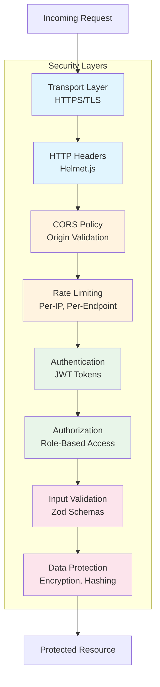

# Security Overview

This document provides a comprehensive overview of the Anplexa platform's security model, covering defense-in-depth strategies, known vulnerabilities, and security checklists for each application.

## Security Model

Anplexa employs a **defense-in-depth** approach with multiple security layers protecting user data and system integrity.



## Layer-by-Layer Security

### 1. Transport Layer Security (TLS)

All production traffic is encrypted using HTTPS/TLS 1.3.

| Aspect | Implementation |
|--------|----------------|
| **Protocol** | TLS 1.3 (minimum TLS 1.2) |
| **Certificate** | Managed by Vercel/Replit |
| **HSTS** | Enabled via Helmet.js |
| **Redirect** | HTTP to HTTPS automatic |

### 2. HTTP Security Headers

Implemented via Helmet.js middleware on the backend API.

| Header | Value | Purpose |
|--------|-------|---------|
| `Strict-Transport-Security` | `max-age=31536000; includeSubDomains` | Enforce HTTPS |
| `X-Content-Type-Options` | `nosniff` | Prevent MIME sniffing |
| `X-Frame-Options` | `DENY` | Prevent clickjacking |
| `X-XSS-Protection` | `1; mode=block` | Legacy XSS protection |
| `Content-Security-Policy` | Restrictive policy | Prevent XSS, injection |
| `Referrer-Policy` | `strict-origin-when-cross-origin` | Control referrer info |

### 3. CORS (Cross-Origin Resource Sharing)

CORS is configured to restrict which origins can access the API.

```javascript
// Current configuration
const corsOptions = {
  origin: [
    process.env.FRONTEND_URL,           // Companions app
    process.env.FUNNEL_URL,             // Funnel app
    'http://localhost:3000',            // Local development
    'http://localhost:5173',            // Local Vite dev
  ],
  credentials: true,
  methods: ['GET', 'POST', 'PUT', 'DELETE', 'PATCH', 'OPTIONS'],
  allowedHeaders: ['Content-Type', 'Authorization', 'X-API-Key'],
};
```

### 4. Rate Limiting

Per-IP rate limiting prevents brute force attacks and DoS.

| Endpoint Category | Limit | Window | Purpose |
|-------------------|-------|--------|---------|
| **Auth - Login** | 10 | 15 min | Brute force prevention |
| **Auth - Register** | 5 | 1 hour | Spam prevention |
| **Auth - Password Reset** | 3 | 1 hour | Email spam prevention |
| **Auth - Magic Link** | 5 | 15 min | Email spam prevention |
| **Chat - Messages** | 60 | 1 min | Resource protection |
| **API - General** | 100 | 1 min | DoS prevention |
| **Admin - Endpoints** | 30 | 1 min | Abuse prevention |

### 5. Authentication

JWT-based authentication with access and refresh tokens.

| Token Type | Expiry | Storage | Rotation |
|------------|--------|---------|----------|
| **Access Token** | 15 minutes | Client (localStorage) | No |
| **Refresh Token** | 7 days | Client + DB (hashed) | Yes, on each use |
| **Exchange Token** | 5 minutes | DB (hashed) | Single-use |
| **Magic Link Token** | 15 minutes | DB (hashed) | Single-use |

See [Authentication Security](/docs/security/authentication-security) for detailed implementation.

### 6. Authorization

Role-based access control (RBAC) with two primary roles.

| Role | Permissions |
|------|-------------|
| **User** | Own conversations, settings, profile |
| **Admin** | All user permissions + admin dashboard, companion config, user management |

```typescript
// Authorization middleware
export const requireAuth = (roles?: UserRole[]) => {
  return async (req, res, next) => {
    const user = req.user;

    if (!user) {
      return res.status(401).json({ error: 'Unauthorized' });
    }

    if (roles && !roles.includes(user.role)) {
      return res.status(403).json({ error: 'Forbidden' });
    }

    next();
  };
};
```

### 7. Input Validation

All API inputs are validated using Zod schemas.

```typescript
// Example: Registration validation
const registerSchema = z.object({
  email: z.string().email('Invalid email format'),
  password: z.string()
    .min(8, 'Password must be at least 8 characters')
    .regex(/[A-Z]/, 'Password must contain uppercase letter')
    .regex(/[a-z]/, 'Password must contain lowercase letter')
    .regex(/[0-9]/, 'Password must contain a number'),
});
```

### 8. Data Protection

| Data Type | Protection Method |
|-----------|-------------------|
| **Passwords** | bcrypt hash (12 rounds) |
| **Tokens (DB)** | SHA-256 hash |
| **PII** | Encrypted at rest (PostgreSQL) |
| **Secrets** | Environment variables, never in code |

---

## Known Vulnerabilities and Mitigations

### HIGH: JWT in localStorage (XSS Vulnerability)

**Risk**: Cross-Site Scripting (XSS) attacks can steal tokens from localStorage.

| Aspect | Detail |
|--------|--------|
| **Severity** | HIGH |
| **Attack Vector** | XSS injection via user input or third-party scripts |
| **Impact** | Session hijacking, account takeover |
| **Affected Apps** | Companions App |

**Current Mitigations**:
- Short access token expiry (15 minutes)
- Refresh token rotation on use
- Content Security Policy headers
- Input sanitization on all user inputs
- Subresource Integrity (SRI) for external scripts

**Recommended Fix**:
```typescript
// Migrate to HttpOnly cookies
res.cookie('accessToken', token, {
  httpOnly: true,
  secure: true,
  sameSite: 'strict',
  maxAge: 15 * 60 * 1000, // 15 minutes
});
```

**Migration Priority**: High - Should be addressed in next security sprint.

---

### MEDIUM: In-Memory Rate Limiting (Scalability Issue)

**Risk**: Rate limiting state is lost on server restart and doesn't work across multiple instances.

| Aspect | Detail |
|--------|--------|
| **Severity** | MEDIUM |
| **Attack Vector** | Coordinated attacks, server restart exploitation |
| **Impact** | Brute force attacks, DoS |
| **Affected Apps** | API Server |

**Current Implementation**:
```typescript
// In-memory store (current)
const rateLimitStore = new Map<string, RateLimitEntry>();
```

**Recommended Fix**:
```typescript
// Redis-based rate limiting
import Redis from 'ioredis';
import { RateLimiterRedis } from 'rate-limiter-flexible';

const redisClient = new Redis(process.env.REDIS_URL);

const rateLimiter = new RateLimiterRedis({
  storeClient: redisClient,
  keyPrefix: 'ratelimit',
  points: 10,
  duration: 60 * 15, // 15 minutes
});
```

**Migration Priority**: Medium - Address when scaling to multiple instances.

---

### MEDIUM: Permissive CORS Configuration

**Risk**: Development origins in production CORS config can be exploited.

| Aspect | Detail |
|--------|--------|
| **Severity** | MEDIUM |
| **Attack Vector** | Origin spoofing, cross-origin attacks |
| **Impact** | Data leakage, CSRF |
| **Affected Apps** | API Server |

**Current Issue**:
```typescript
// Problematic: localhost origins in production
origin: [
  process.env.FRONTEND_URL,
  'http://localhost:3000',  // Should not be in prod
  'http://localhost:5173',  // Should not be in prod
],
```

**Recommended Fix**:
```typescript
// Environment-aware CORS
const allowedOrigins = process.env.NODE_ENV === 'production'
  ? [process.env.FRONTEND_URL, process.env.FUNNEL_URL]
  : ['http://localhost:3000', 'http://localhost:5173'];

const corsOptions = {
  origin: (origin, callback) => {
    if (!origin || allowedOrigins.includes(origin)) {
      callback(null, true);
    } else {
      callback(new Error('Not allowed by CORS'));
    }
  },
  credentials: true,
};
```

**Migration Priority**: Medium - Should be in pre-production checklist.

---

### LOW: Missing Request ID Logging

**Risk**: Difficulty tracing requests across services for security audits.

| Aspect | Detail |
|--------|--------|
| **Severity** | LOW |
| **Impact** | Reduced incident response capability |

**Recommended Fix**: Add request ID middleware and structured logging.

---

## Security Checklists

### Backend API Security Checklist

| Category | Item | Status | Notes |
|----------|------|--------|-------|
| **Transport** | HTTPS enforced | Done | Via hosting provider |
| **Transport** | TLS 1.2+ only | Done | Via hosting provider |
| **Headers** | Helmet.js configured | Done | All security headers |
| **Headers** | HSTS enabled | Done | 1 year max-age |
| **CORS** | Restricted origins | Partial | Remove localhost in prod |
| **Rate Limiting** | Auth endpoints | Done | Per-IP limiting |
| **Rate Limiting** | General API | Done | 100 req/min |
| **Rate Limiting** | Redis backend | Todo | In-memory currently |
| **Auth** | Password hashing | Done | bcrypt 12 rounds |
| **Auth** | JWT expiry | Done | 15 min access, 7 day refresh |
| **Auth** | Token rotation | Done | Refresh tokens rotated |
| **Auth** | HttpOnly cookies | Todo | Using localStorage |
| **Validation** | Zod schemas | Done | All endpoints |
| **Validation** | SQL injection | Done | Drizzle ORM parameterized |
| **Logging** | Audit logs | Partial | Auth events only |
| **Logging** | Request IDs | Todo | Not implemented |
| **Secrets** | Env vars only | Done | No hardcoded secrets |
| **Webhooks** | Signature verification | Done | Stripe webhooks |

### Companions App Security Checklist

| Category | Item | Status | Notes |
|----------|------|--------|-------|
| **XSS** | Input sanitization | Done | React auto-escaping |
| **XSS** | CSP headers | Done | Via Next.js config |
| **Storage** | Token storage | Risk | localStorage (XSS vulnerable) |
| **Dependencies** | Audit | Done | npm audit in CI |
| **Dependencies** | SRI hashes | Partial | External scripts |
| **Analytics** | PII protection | Done | PostHog/Clarity config |
| **API Keys** | Client exposure | Done | No secrets in client |

### Funnel App Security Checklist

| Category | Item | Status | Notes |
|----------|------|--------|-------|
| **Payment** | Stripe.js | Done | PCI compliant |
| **Payment** | Server-side price | Done | Prices from API, not client |
| **XSS** | Input sanitization | Done | React auto-escaping |
| **Redirect** | Open redirect check | Done | Whitelist validation |
| **Exchange Token** | Short expiry | Done | 5 minute expiry |
| **Exchange Token** | Single use | Done | Deleted after use |

---

## Recommended Improvements

### Immediate (Critical Path)

1. **Migrate tokens to HttpOnly cookies**
   - Eliminates XSS token theft
   - Requires backend cookie handling
   - Add CSRF protection

2. **Environment-aware CORS**
   - Remove development origins in production
   - Strict origin validation

3. **Redis rate limiting**
   - Required before horizontal scaling
   - Provides distributed state

### Short-term (Next Quarter)

4. **Structured audit logging**
   - Request IDs for tracing
   - Security event logging
   - Log aggregation (e.g., Datadog, ELK)

5. **Security headers audit**
   - Review and tighten CSP
   - Add Permissions-Policy
   - Report-Only mode for testing

6. **Dependency scanning**
   - Automated vulnerability scanning
   - Snyk or GitHub Dependabot
   - CI pipeline integration

### Long-term (Roadmap)

7. **Web Application Firewall (WAF)**
   - Cloudflare or AWS WAF
   - Bot protection
   - DDoS mitigation

8. **Penetration testing**
   - Annual third-party assessment
   - Bug bounty program consideration

9. **SOC 2 compliance preparation**
   - Access controls documentation
   - Audit trail requirements
   - Security policies

---

## Incident Response

### Security Contact

Report security vulnerabilities to: **security@anplexa.com**

### Response Process

1. **Triage**: Assess severity within 4 hours
2. **Contain**: Implement immediate mitigations
3. **Investigate**: Root cause analysis
4. **Remediate**: Deploy fix
5. **Communicate**: Notify affected users if needed
6. **Review**: Post-incident review and documentation

---

## Related Documentation

- [Authentication Security](/docs/security/authentication-security) - Detailed JWT and token handling
- [Architecture Overview](/docs/architecture/overview) - System architecture
- [Authentication Flows](/docs/user-flows/authentication) - Sequence diagrams
- [API Reference](/docs/api/authentication) - Endpoint documentation
