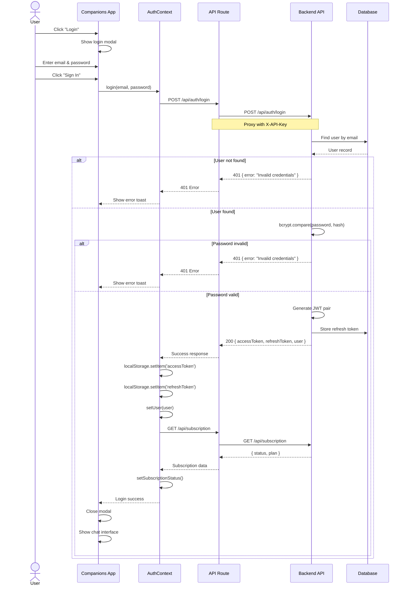
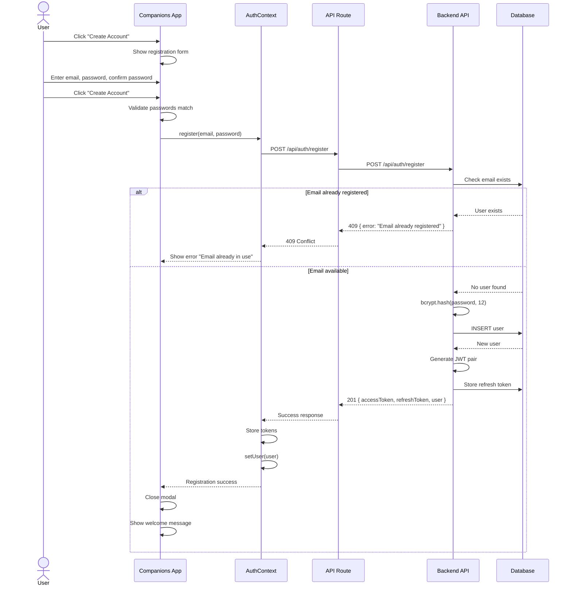
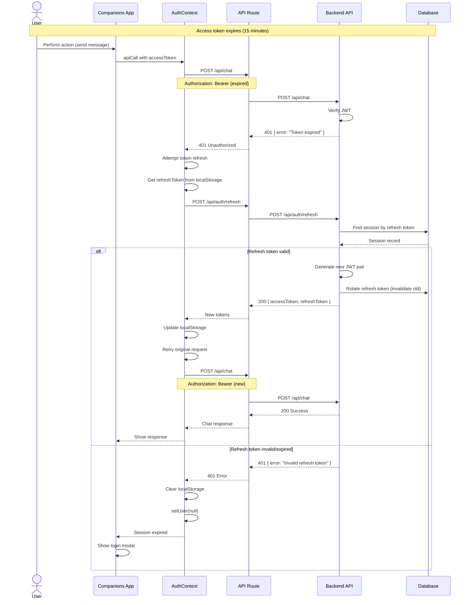
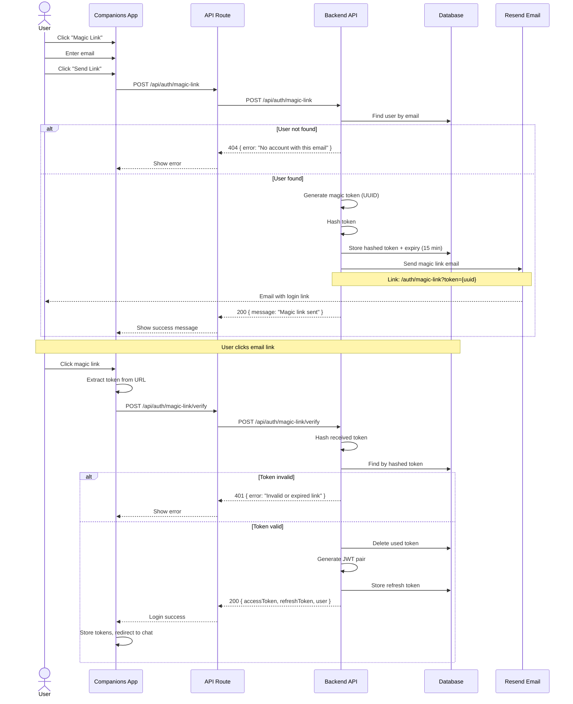
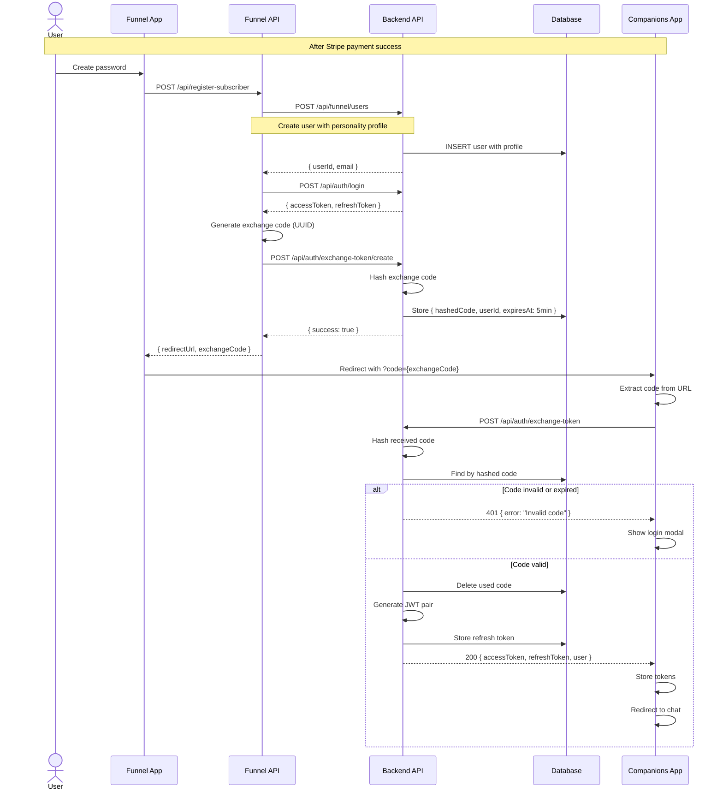
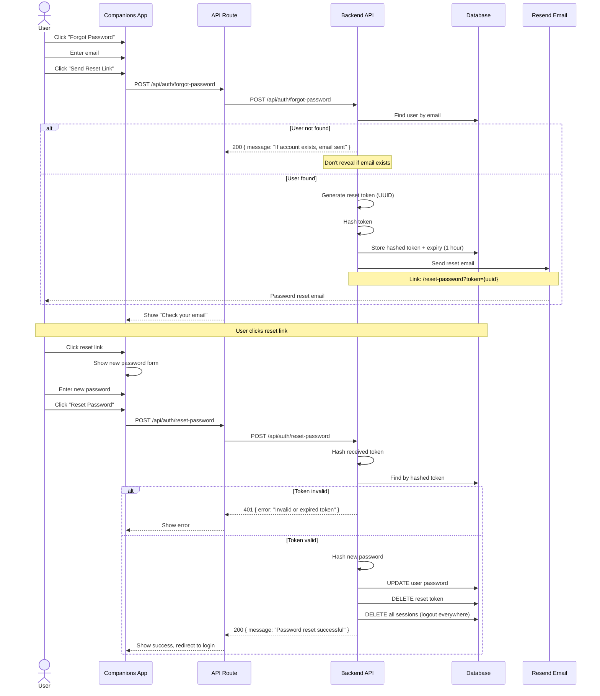
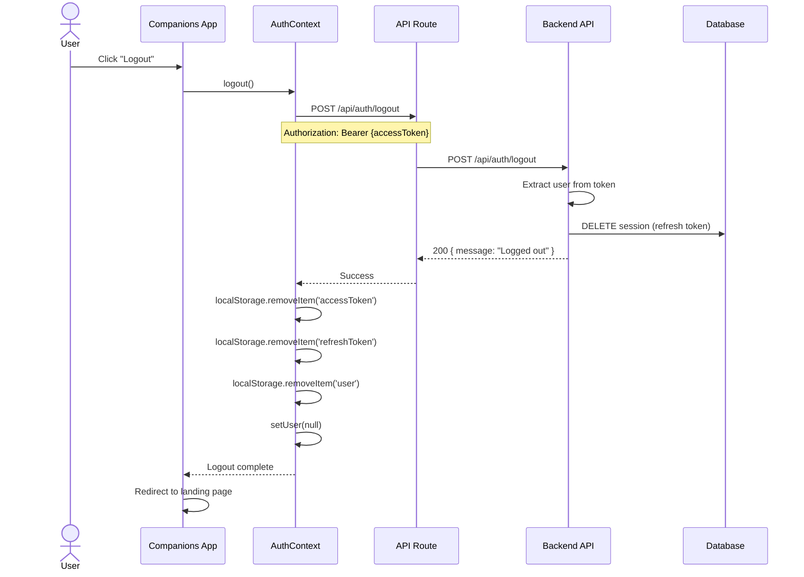
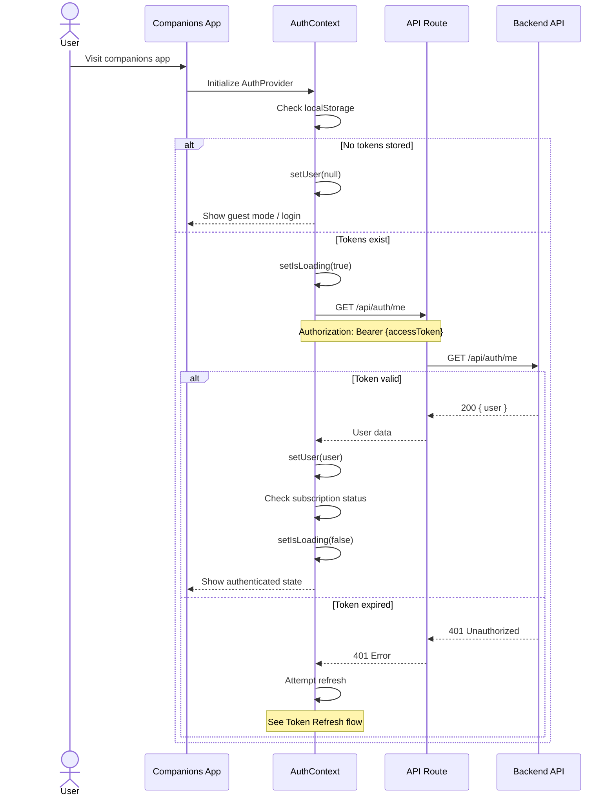

# Authentication Flows

Detailed sequence diagrams for all authentication scenarios in the Anplexa platform.

## Email/Password Login

Standard login flow for returning users.

## User Registration

New user account creation flow.

## Token Refresh

Automatic token refresh when access token expires.

## Magic Link Authentication

Passwordless login via email link.

## Exchange Token Flow

Cross-app authentication from Funnel to Companions.

## Password Reset

Forgot password recovery flow.

## Logout

Session termination flow.

## Session Validation

How the app validates an existing session on page load.

## Security Considerations

### Token Storage

| Token | Storage | Concerns | Mitigation |
|-------|---------|----------|------------|
| Access Token | localStorage | XSS vulnerability | Short expiry (15 min), migrate to HttpOnly cookies |
| Refresh Token | localStorage | XSS vulnerability | Longer expiry (7 days), rotation on use |

### Rate Limiting

| Endpoint | Limit | Window | Purpose |
|----------|-------|--------|---------|
| `/auth/login` | 10 | 15 min | Brute force prevention |
| `/auth/register` | 5 | 1 hour | Spam prevention |
| `/auth/forgot-password` | 3 | 1 hour | Email spam prevention |
| `/auth/magic-link` | 5 | 15 min | Email spam prevention |

### Token Security

- **Access tokens**: Signed with HS256, 15-minute expiry
- **Refresh tokens**: Rotated on each use, stored hashed in DB
- **Exchange tokens**: Single-use, 5-minute expiry, hashed storage
- **Magic link tokens**: Single-use, 15-minute expiry, hashed storage
- **Reset tokens**: Single-use, 1-hour expiry, hashed storage
