# Chat Flow

Detailed sequence diagrams for the AI chat functionality.

## Send Message (Authenticated)

Standard chat flow for logged-in users.

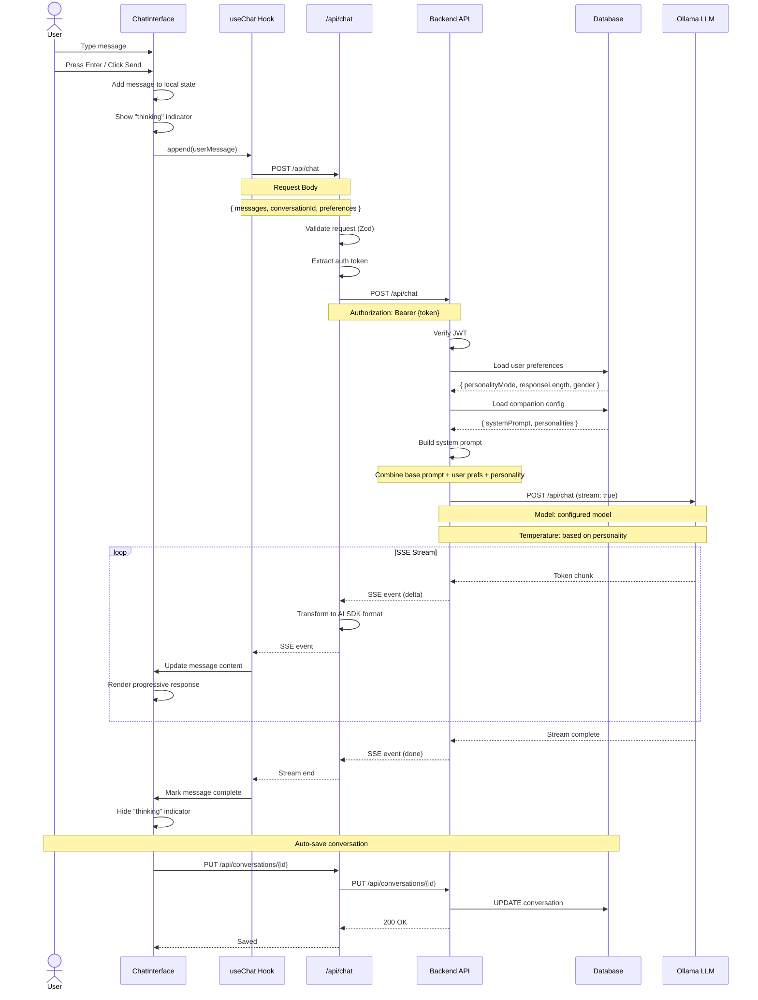

## Send Message (Guest Mode)

Chat flow for unauthenticated users with message limits.

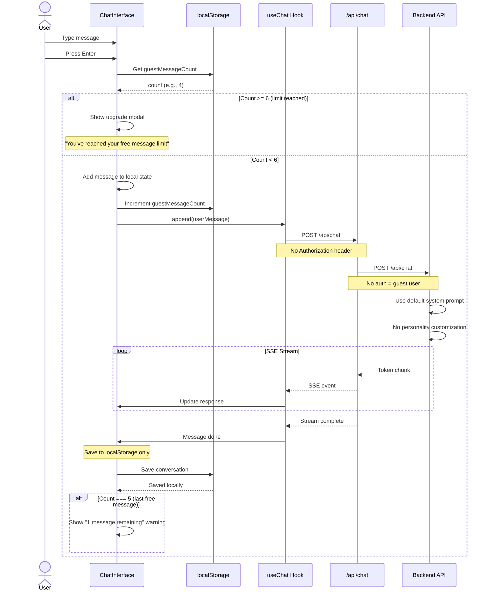

## Conversation Management

### Load Conversations

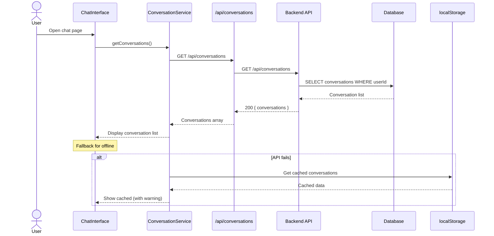

### Create New Conversation

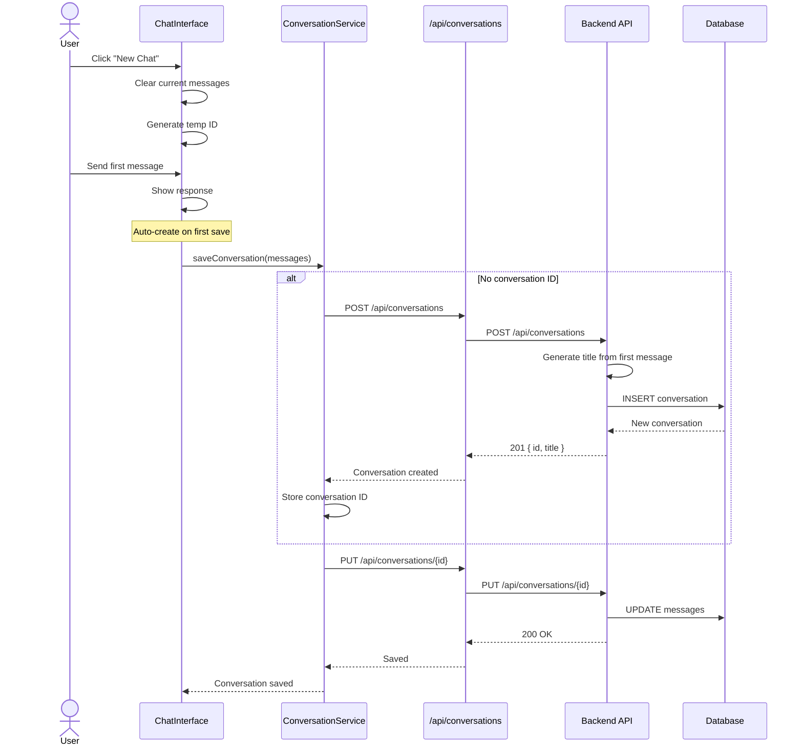

### Delete Conversation

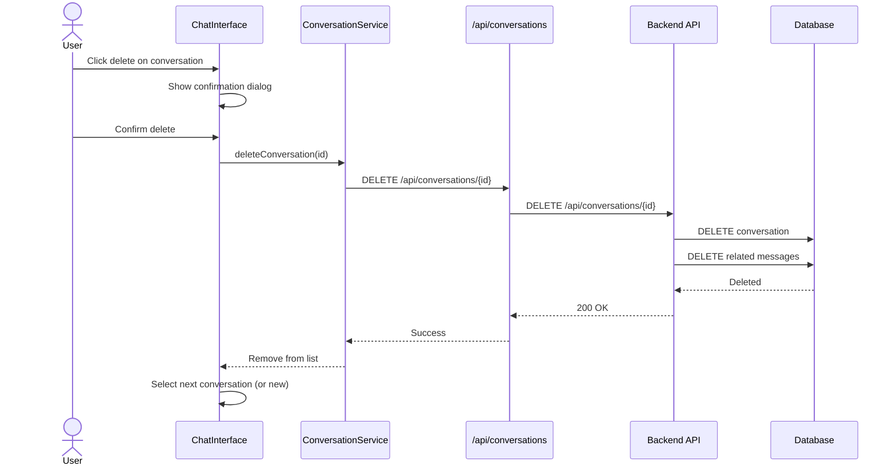

## Ice Breaker Flow

Pre-defined conversation starters.

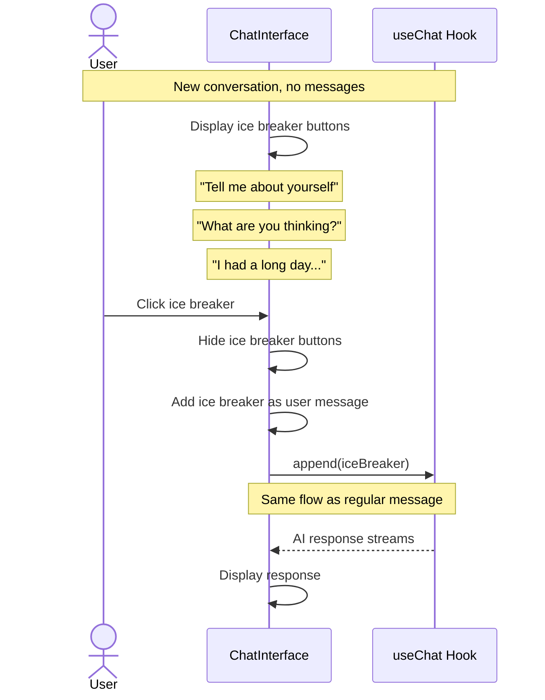

## Settings & Preferences

### Update Response Preferences

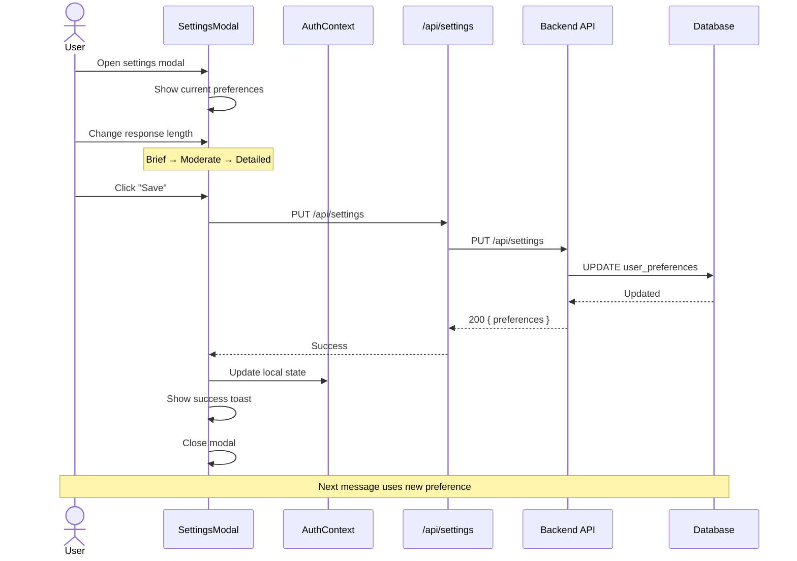

### Change Personality Mode

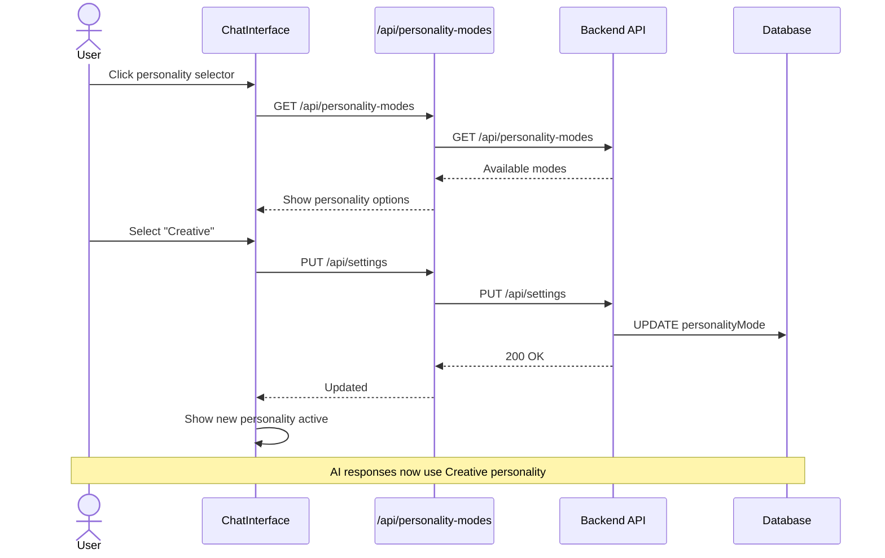

## Error Handling

### Credit Limit Reached

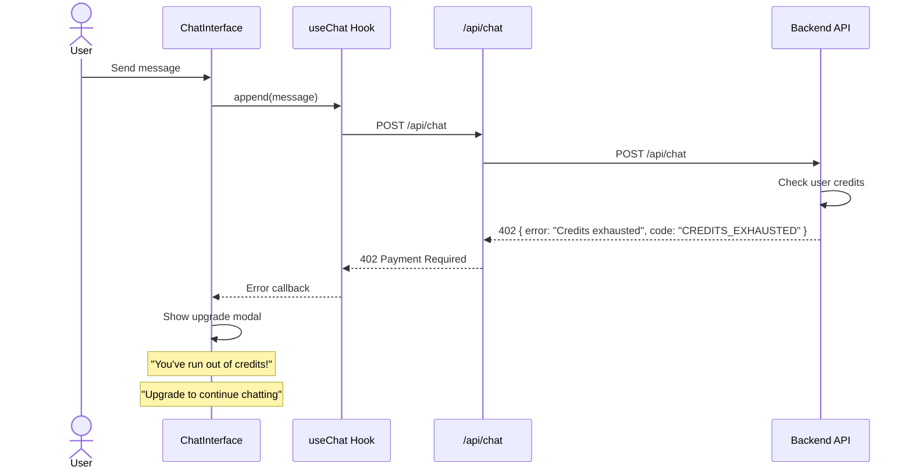

### Network Error

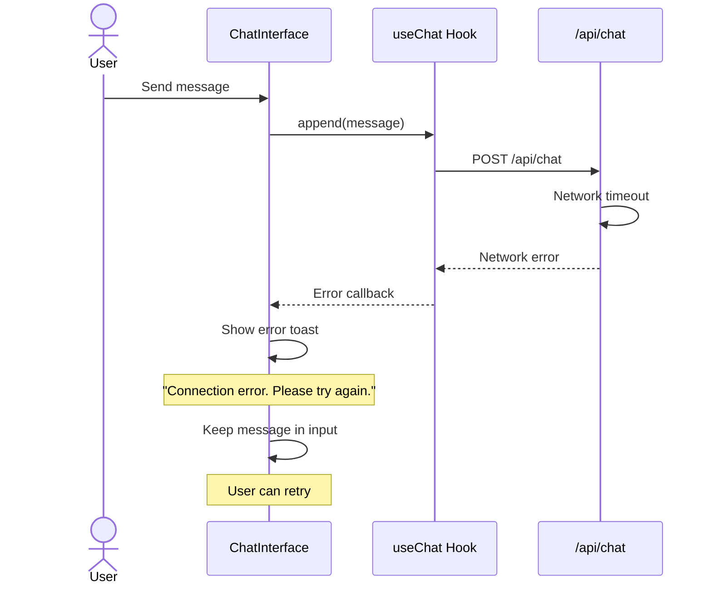

### Stream Interruption

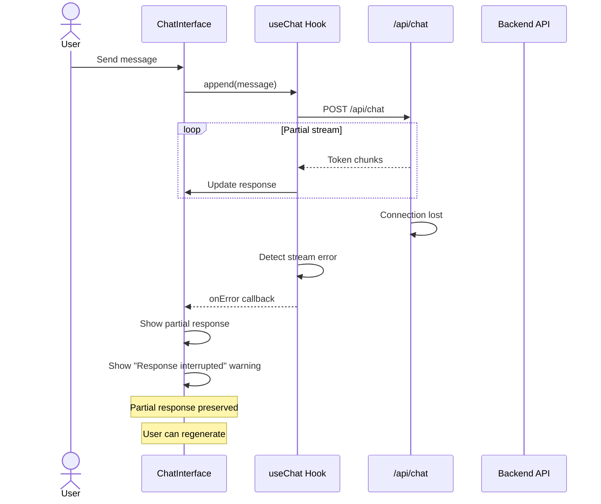

## SSE Stream Format

### Wire Format

```
event: delta
data: {"content": "Hello"}

event: delta
data: {"content": " there"}

event: delta
data: {"content": "!"}

event: done
data: {"messageId": "uuid-xxx", "finishReason": "stop"}
```

### AI SDK Transformation

```typescript
// Backend SSE format
// data: {"message":{"content":"token"}}

// Transformed for AI SDK v5
// data: {"type":"text-delta","textDelta":"token"}
```

## Performance Considerations

| Metric | Target | Current |
|--------|--------|---------|
| Time to first token | < 500ms | ~800ms |
| Token throughput | 30+ tokens/sec | ~25 tokens/sec |
| Message save debounce | 1 second | 1 second |
| Conversation load | < 200ms | ~150ms |

### Optimization Opportunities

1. **Streaming buffer**: Batch small tokens for smoother rendering
2. **Optimistic updates**: Show user message immediately
3. **Connection pooling**: Reuse Ollama connections
4. **Message pagination**: Lazy load old messages
