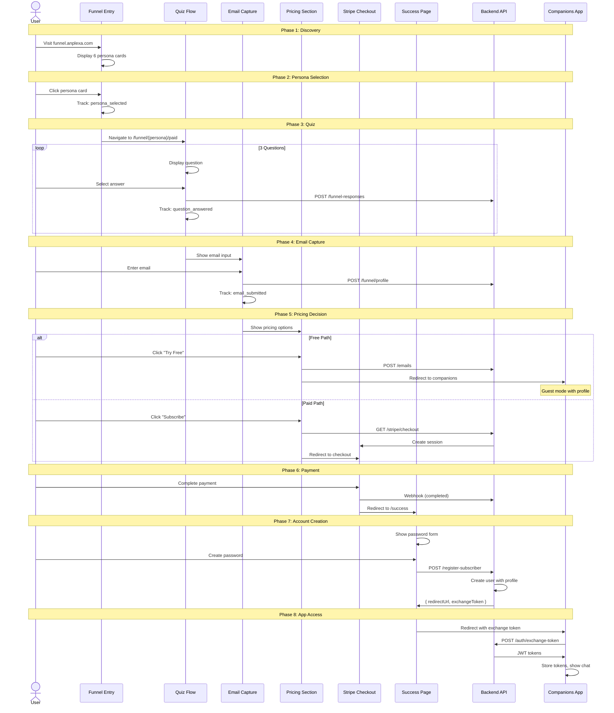
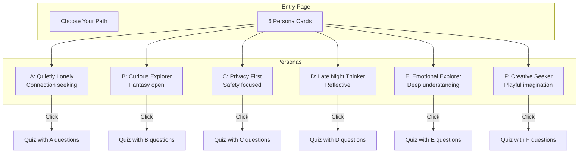
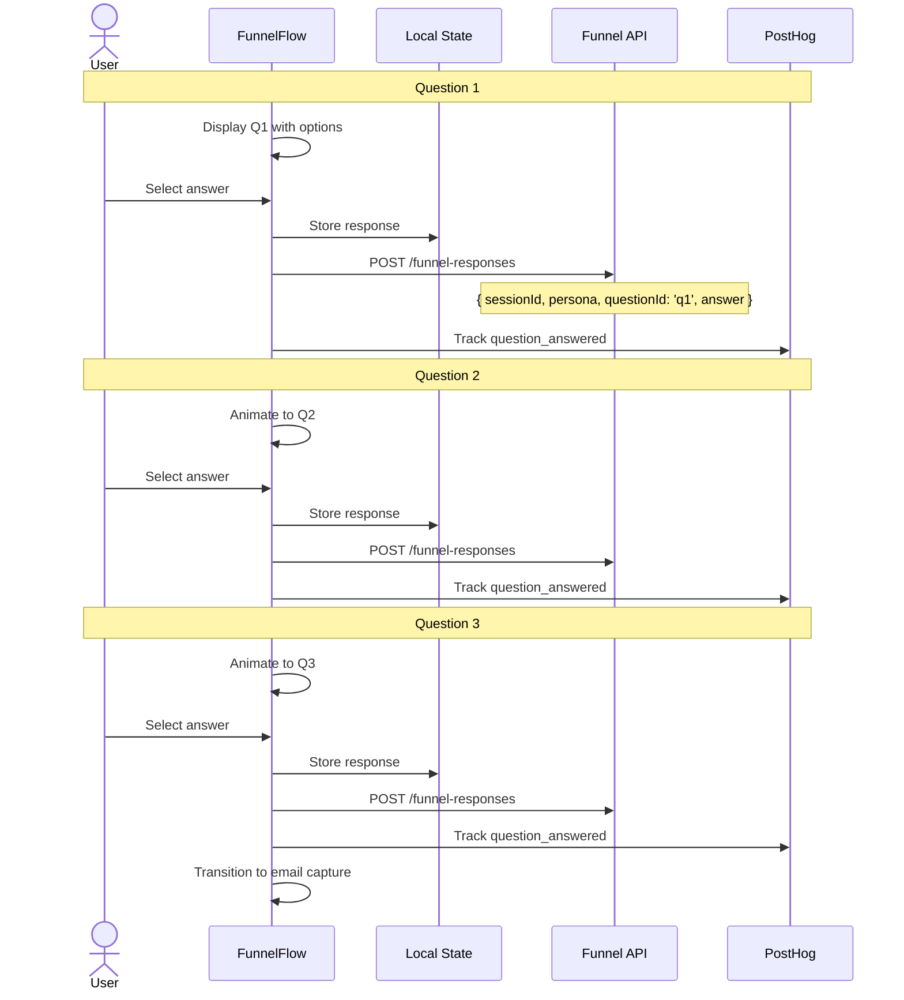
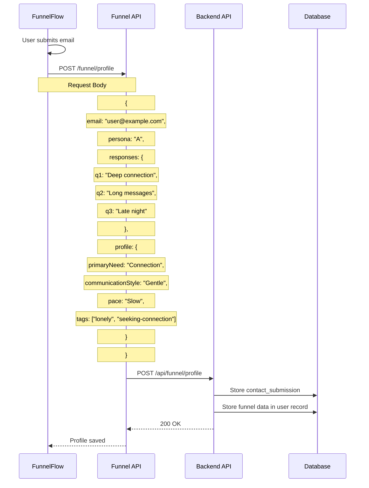
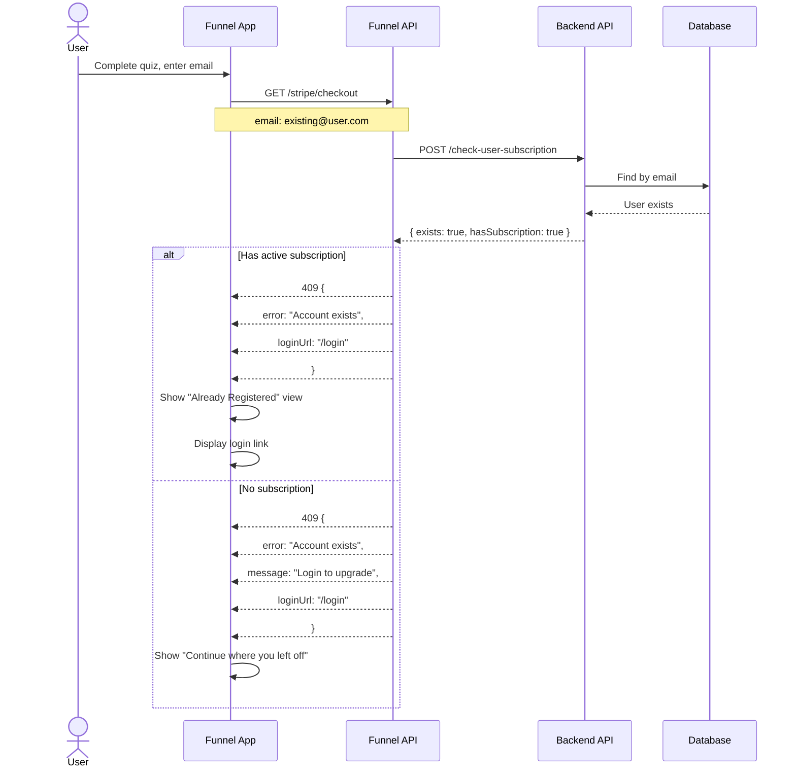
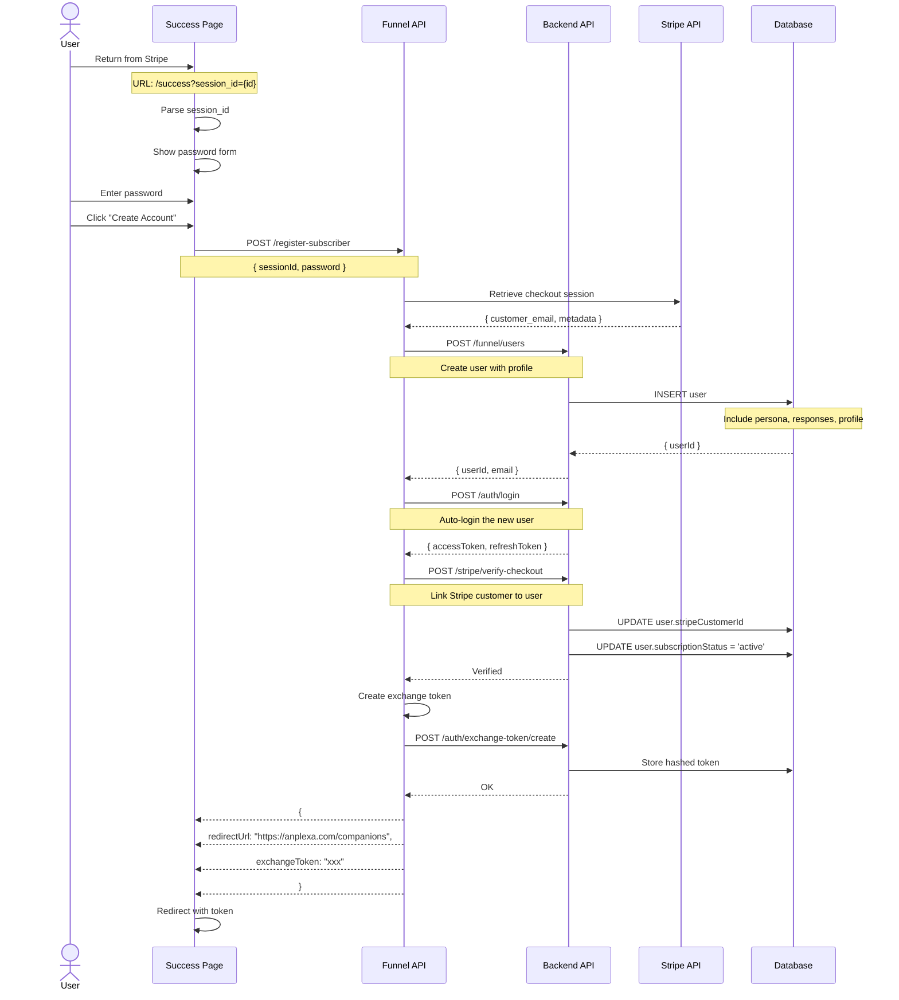
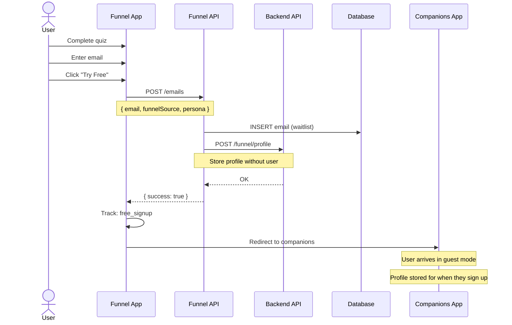
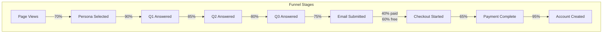
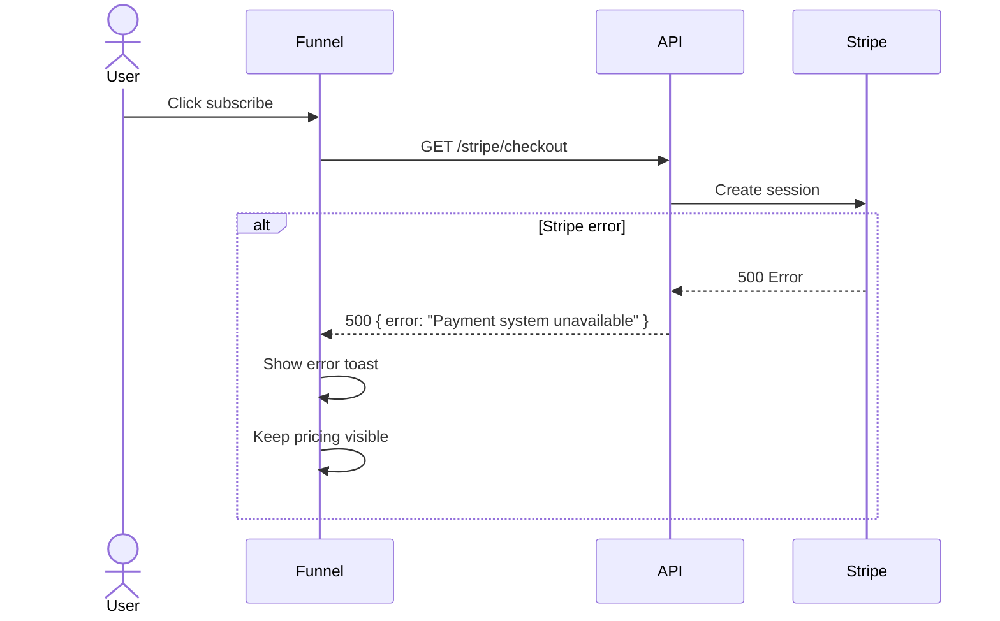
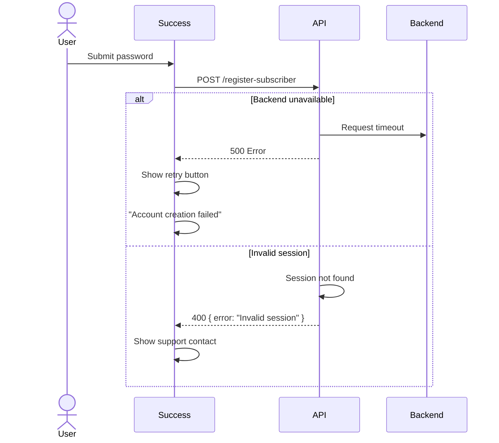

# Funnel Conversion Flow

Complete user journey through the marketing funnel, from discovery to account creation.

## Complete Conversion Flow



## Persona Selection



## Quiz Flow Detail

Each persona has 3 tailored questions:



### Example Questions (Persona A)

| Q# | Question | Options |
|----|----------|---------|
| 1 | What do you look for most in a conversation? | Understanding, Entertainment, Deep connection, Practical advice |
| 2 | How do you prefer to communicate? | Long messages, Short exchanges, Voice notes, Mixed |
| 3 | What time do you usually chat? | Morning, Afternoon, Evening, Late night |

## Profile Submission

After email capture, personality profile is sent to backend.



## Duplicate User Handling



## Registration Flow Detail

After successful Stripe payment:



## Free Path Flow



## Analytics Events

### Funnel Stage Tracking

| Stage | Event | Properties |
|-------|-------|------------|
| Entry | `funnel_start` | (empty) |
| Persona Select | `persona_selected` | persona |
| Q1 Answer | `question_answered` | persona, questionId: 'q1', answer |
| Q2 Answer | `question_answered` | persona, questionId: 'q2', answer |
| Q3 Answer | `question_answered` | persona, questionId: 'q3', answer |
| Email Submit | `email_submitted` | persona, path: 'paid' or 'free' |
| Checkout Start | `checkout_started` | persona, priceId |
| Checkout Complete | `checkout_completed` | persona |
| Account Create | `account_created` | persona |
| Free Signup | `free_signup` | persona |

### Conversion Funnel Analysis



## Error States

### Checkout Creation Failure



### Registration Failure



## Session State Management

### Current Issue: State Lost on Refresh

```typescript
// Current: State in React useState (lost on refresh)
const [sessionId] = useState(() => crypto.randomUUID());
const [responses, setResponses] = useState({});
```

### Recommended: Persist to localStorage

```typescript
// Recommended: useFunnelSession hook
function useFunnelSession(persona: string) {
  const [session, setSession] = useState(() => {
    const key = `funnel-session-${persona}`;
    const saved = localStorage.getItem(key);
    if (saved) {
      const parsed = JSON.parse(saved);
      // Check if session is less than 1 hour old
      if (Date.now() - parsed.createdAt < 3600000) {
        return parsed;
      }
    }
    return {
      id: crypto.randomUUID(),
      persona,
      responses: {},
      email: null,
      createdAt: Date.now(),
    };
  });

  useEffect(() => {
    localStorage.setItem(`funnel-session-${persona}`, JSON.stringify(session));
  }, [session, persona]);

  return { session, updateResponse, setEmail, clearSession };
}
```
