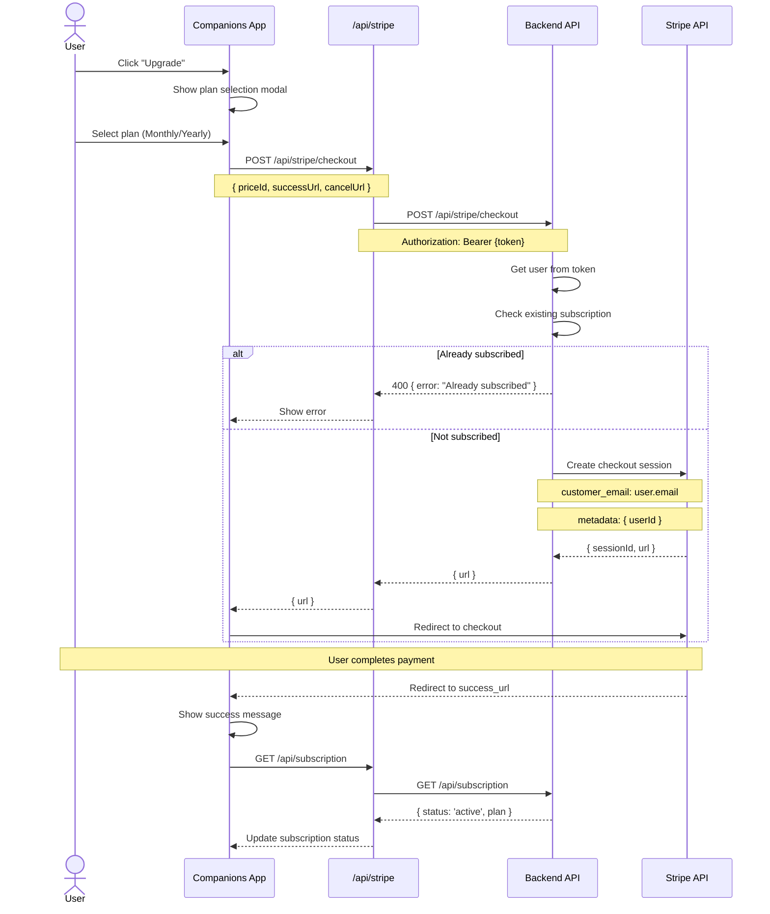
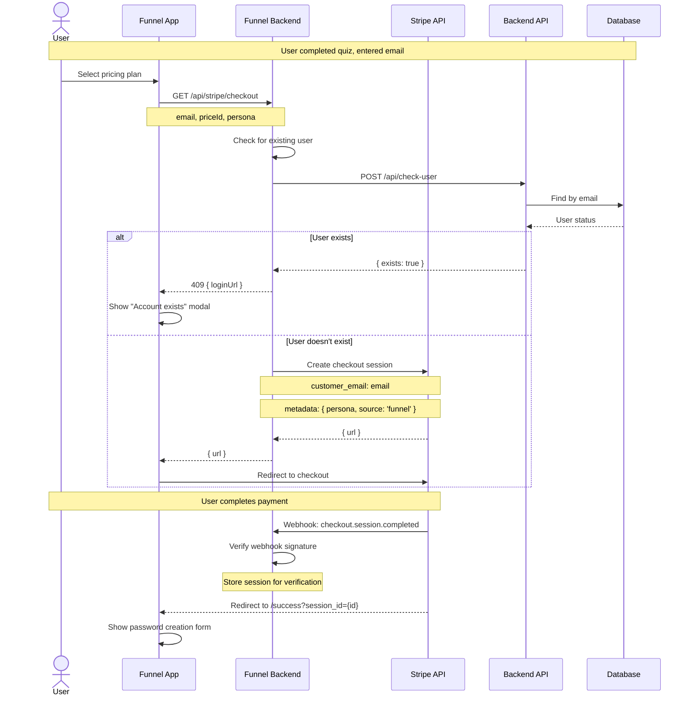
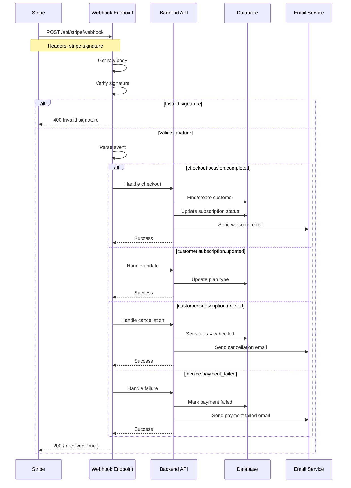
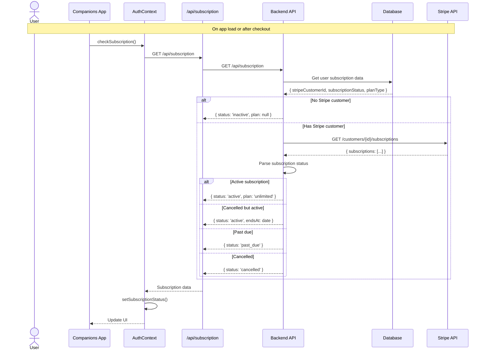
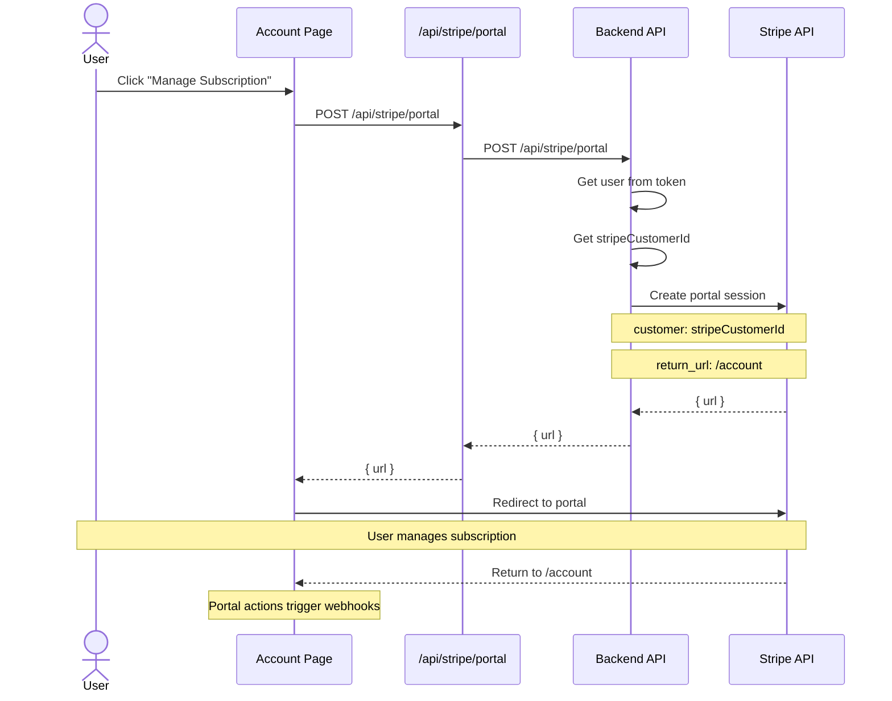
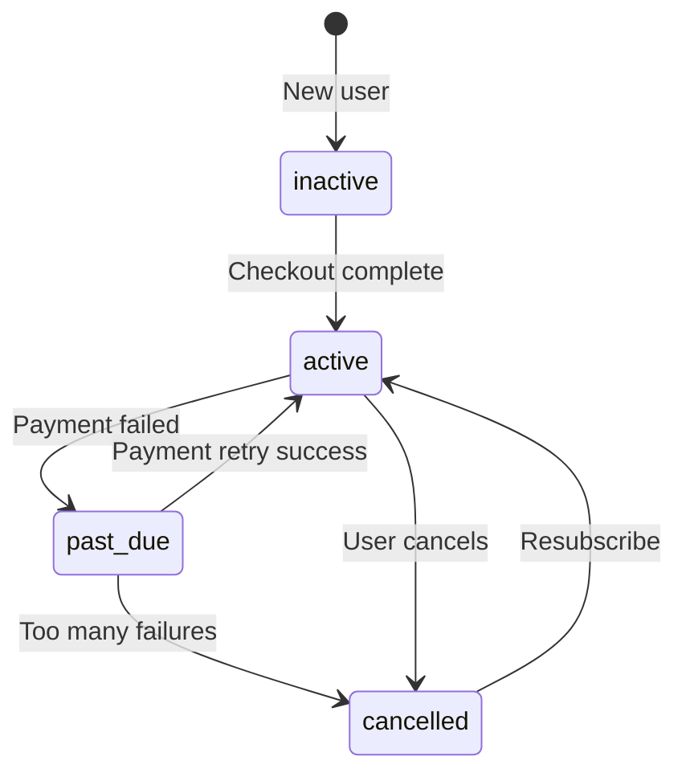
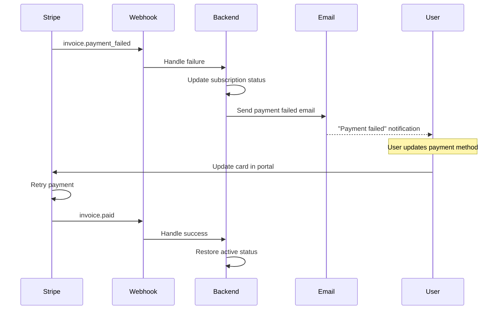
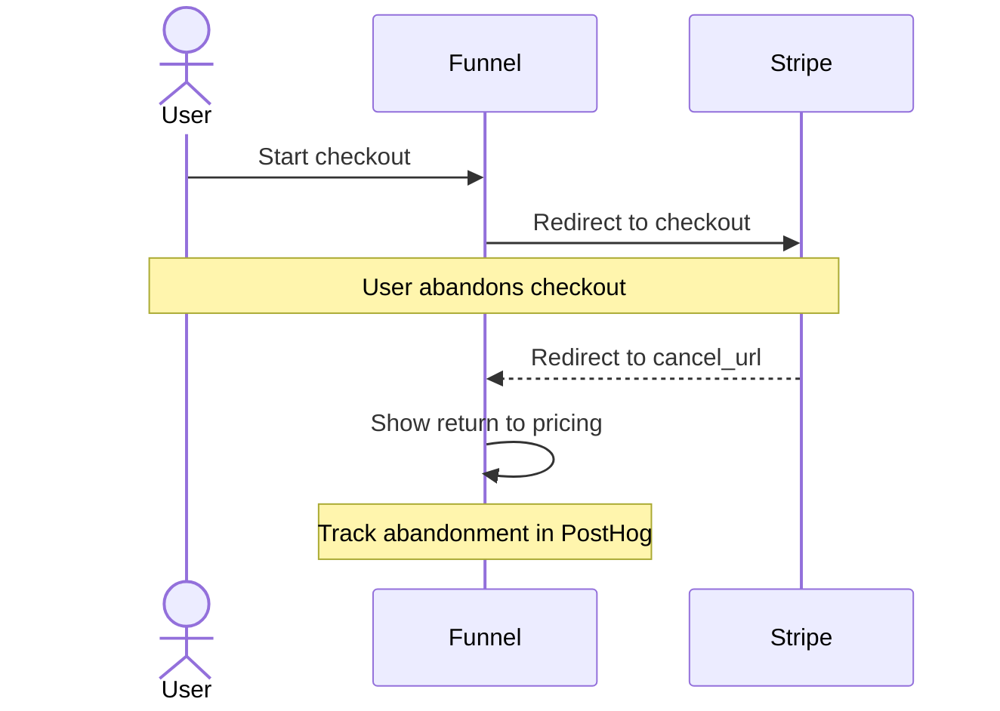

# Subscription Flow

Payment and subscription management flows using Stripe.

## Checkout Flow (Companions App)

Upgrade flow for existing users.



## Checkout Flow (Funnel App)

New user signup through marketing funnel.



## Webhook Processing

Stripe webhook handling for subscription events.



## Subscription Status Check

How the app checks subscription status.



## Subscription Management Portal

Customer portal for managing subscriptions.



## Plan Types

### Available Plans

| Plan | ID | Price | Billing | Features |
|------|------|-------|---------|----------|
| Monthly | `price_monthly_*` | £2.99 | Monthly | Unlimited messages |
| Early Believer | `price_yearly_*` | £11.99 | Yearly | Unlimited messages, priority support |

### Subscription States



### Status Mapping

| Status | Can Chat | Show Upgrade | Description |
|--------|----------|--------------|-------------|
| `active` | Yes | No | Active subscription |
| `trialing` | Yes | No | Trial period |
| `past_due` | Yes (grace) | Yes | Payment failed, grace period |
| `cancelled` | Until period end | Yes | Cancelled but paid until end |
| `inactive` | Guest only | Yes | No subscription |

## Stripe Event Types

### Handled Events

| Event | Trigger | Action |
|-------|---------|--------|
| `checkout.session.completed` | Payment success | Create/link customer, activate subscription |
| `customer.subscription.created` | New subscription | Update user subscription status |
| `customer.subscription.updated` | Plan change/renewal | Update plan type, status |
| `customer.subscription.deleted` | Cancellation complete | Set status to cancelled |
| `invoice.paid` | Successful payment | Log payment, extend access |
| `invoice.payment_failed` | Failed payment | Send warning, set past_due |

### Event Processing

```typescript
// Webhook handler structure
switch (event.type) {
  case 'checkout.session.completed':
    const session = event.data.object as Stripe.Checkout.Session;
    await handleCheckoutComplete(session);
    break;

  case 'customer.subscription.updated':
    const subscription = event.data.object as Stripe.Subscription;
    await handleSubscriptionUpdate(subscription);
    break;

  case 'customer.subscription.deleted':
    const cancelled = event.data.object as Stripe.Subscription;
    await handleSubscriptionCancelled(cancelled);
    break;

  case 'invoice.payment_failed':
    const invoice = event.data.object as Stripe.Invoice;
    await handlePaymentFailed(invoice);
    break;
}
```

## Error Handling

### Payment Failures



### Checkout Abandonment



## Security Considerations

### Webhook Security

1. **Signature verification**: Always verify `stripe-signature` header
2. **Idempotency**: Handle duplicate events gracefully
3. **HTTPS only**: Webhook endpoint must be HTTPS
4. **Timing**: Process webhooks within 30 seconds

### Customer Data

1. **Don't store card details**: Stripe handles all PCI compliance
2. **Store only references**: `stripeCustomerId`, `subscriptionId`
3. **Use metadata**: Link Stripe objects to internal users via metadata
4. **Audit logging**: Log all subscription changes

### Price ID Management

```typescript
// Environment-based price IDs
const PRICES = {
  development: {
    monthly: 'price_test_monthly',
    yearly: 'price_test_yearly',
  },
  production: {
    monthly: process.env.STRIPE_PRICE_MONTHLY,
    yearly: process.env.STRIPE_PRICE_YEARLY,
  },
};

const prices = PRICES[process.env.NODE_ENV] || PRICES.development;
```
